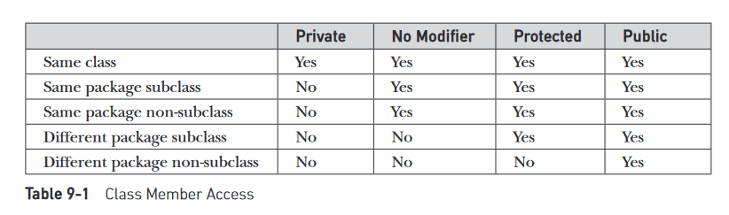

# Java Revision for Interviews

Reference materials
- Java - The Complete Reference [9th Edition]


## Plan - Cover the following topics
### Easy Topics
- Java Buzzwords ✅
- Three OOP principles✅
	- Inheritance
	- Encapsulation
	- Polymorphism
	- Abstraction
- primitive types in java✅
- type conversion and casting✅
- Java arrays(initializing and declaration)✅
	- 2-d arrays
- Operators (just skim through the operators)✅
- control flow statements✅
	- for-each loop
- Class Fundamentals✅
	- what is a class?
	- what are objects?
	- declaring a class
	- what are methods
	- constructor
- **this** keyword✅
	- Instance Variable Hiding
- garbage collection✅
- finalize() method✅
- method overloading✅
- constructor overloading✅
- **static** keyword✅
- access control✅
- **final** keyword✅
- Nested and inner classes✅
- using command line arguments✅
- variable length argument✅
- inheritance basics✅
- golden rule - super class variable can access a subclass object✅
- types of inheritance supported in Java✅
- use of **super** in inheritance✅
- method overriding✅
- Dynamic Method Dispatch✅
- Abstract Classes✅
- use of **final** with inheritance✅
- **Object** class✅
- Packages
- Interfaces
	- **static** methods in an interfaces
- Exception handling
	- try-catch
	- nested try statements
	- throw
	- throws
	- finally
- Creating your own exception subclass
- chained exceptions

### Moderate Topics
- Multithreaded Programming
- Enumerations, Autoboxing and Annotations
- Generics
- Lambda Expressions


### Java Library Topics
Try to go through the entire library and make a note of useful classes and features.


## Notes
- Java buzzwords
	- simple
	- object oriented - not purely OO, becuase has primitive types
	- robust - provides reliability, it is strictly typed, handles memory management, and exception handling
	- multithreaded - provides support for multithreaded architectures
	- architecture neutral - JVM allows "write once, run anywhere, anytime, forever"
	- integrated and high performance - although it is cross platform provides good performance. Java is a compiled programming language, but rather than compile straight to executable machine code, it compiles to an intermediate binary form called JVM byte code. The byte code is then compiled and/or interpreted to run the program.
	- distributed - designed to work on distributed environent. Handles TCP/IP protocols. Remote Method Invocation supported bu Java, allows programs to invoke methods across the network.
	- Dynamic
- process oriented programming(C/C++), code acting on data
- object oriented programming, data controlling access to code
- **Abstraction**: we manage complexity through abstraction. e.g. We do not think of a car as a set of tens of thousands of parts, but as a well-defined object with its own unique behaviour. This allows us to drive to our workplace(or anywhere else for that matter), without being overwhelmed by the complexity. One way to manage complexity is through heirarchial abstraction
- OOP Principle 1, **Encapsulation**: Mechanism that binds together code and the data it manipulates and keeps both safe from outside interference and misuse. One way to think about encapsulation is as a protective wrapper that prevents the code and data from being arbitrarily accessed by other code defined outside the wrapper. To relate this to the real world, consider the automatic transmission on an automobile. It encapsulates hundreds of bits of information about your engine, such as how much you are accelerating, the pitch of the surface you are on, and the position of the shift lever. You, as the user, have only one method of affecting this complex encapsulation: by moving the gear-shift lever. You can’t affect the transmission by using the turn signal or windshield wipers, for example. Thus, the gear-shift lever is a well-defined (indeed, unique) interface to the transmission. Further, what occurs inside the transmission does not affect objects outside the transmission. ecause an automatic transmission is encapsulated, dozens of car manufacturers can implement one in any way they please. However, from the driver’s point of view, they all work the same. In Java, the basis of encapsulation is the class. (_Also talk about how Java implements encapsulation, using the public, private, protected keywords and class).
- A good example of abstraction and encapsulation: Suppose you go to an automatic cola vending machine and request for a cola. The machine processes your request and gives the cola.
	- Here automatic cola vending machine is a class. It contains both data i.e. Cola can and operations i.e. service mechanism and they are wrapped/integrated under a single unit Cola Vending Machine. This is called Encapsulation.
	- You need not know how the machine is working. This is called Abstraction.
	- You can interact with cola can only through service mechanism. You cannot access the details about internal data like how much cans it contains, mechanism etc. This is Data Hiding.
	- You cannot pick the cola can directly. You request for cola through proper instructions and request mechanism (i.e. by paying amount and filling request) and get that cola only through specified channel. This is message passing.
- OOP Principle 2, **Inheritance**: Inheritance is the process by which one object acquires the properties of another object. (Allows reuse of code). It is important because it supports the concept of heirarchial classification. For eg. A Golden Retriever is a breed of dog, which is in turn a mammal, which is in turn an animal. Without the use of hierarchies, each object would need to define all of its characteristics explicitly. However, by use of inheritance, an object need only define those qualities that make it unique within its class. It can inherit its general attributes from its parent. Thus, it is the inheritance mechanism that makes it possible for one object to be a specific instance of a more general case. 
- OOP Principle 3, **Polymorphism**: Polymorphism(meaning, "many forms"), is a feature that allows one interface to be used for a general class of actions. The specific action is determined by the exact nature of the situation. Consider a stack (which is a last-in, first-out list). You might have a program that requires three types of stacks. One stack is used for integer values, one for floating-point values, and one for characters. The algorithm that implements each stack is the same, even though the data being stored differs. In a non–object-oriented language, you would be required to create three different sets of stack routines, with each set using different names.However, because of polymorphism, in Java you can specify a general set of stack routines that all share the same names. Polymorphism is defined by “one interface, multiple methods.” Extending the dog analogy, a dog’s sense of smell is polymorphic. If the dog smells a cat, it will bark and run after it. If the dog smells its food, it will salivate and run to its bowl. The same sense of smell is at work in both situations. The difference is what is being smelled, that is, the type of data being operated upon by the dog’s nose!
- _main()_ method is declared public because it is called by code outside(JVM) of its class when the program begins.
- Java is a **strongly typed** language, i.e. every variable and expressions have a type and that type is explicitly defined. All assignments are checked for type compatibility.
- Primitive types: Integers(byte, short, int, long), Floating Point(float, double), Characters(char), Boolean. 
- All primitive types in java have a strictly defined range(unlike C/C++ which depends on the environment the programs are run)
- Automatic type conversion: When one type of data is assigned to another type of variable, automatic type conversion takes place, when the following two condition are met
	1. the two types are compatible
	2. destination type is larger than source type<br>
When these two conditions are met, a widening conversion takes place. For widening conversions, the numeric types, including integer and floating-point types, are compatible with each other. However, there are no automatic conversions from the numeric types to char or boolean. Also, char and boolean are not compatible with each other
- Casting incompatible types(narrowing conversion): To create a conversion between two incompatible types, you must use a **cast**. A cast is
simply an explicit type conversion. It has this general form: 
	`(target-type) value`
Example - the following casts an integer to byte
	```java
	   int a;
	   byte b;
       // …
	   b = (byte) a;
	```
- casting a float to int will cause truncation
- arrays are group of variables of the same type referred by a common name. 
	- `int month_days[]` declares an array, but at this point no array actually exists
	- To link the array with actual physical array of integers we allocate memory to it using **new** keyword. This is how its done. `month_days = new int[12]`.
	- All arrays in java are dynamically allocated
	- [Arrays Program](https://github.com/zed1025/java-notes/blob/master/arrays.java)
	- declaring 2-d arrays. `int matrix[][] = new int[3][3];`. We can even declare the second dimension manually.
		```
		int twoD[][] = new int[4][];
		twoD[0] = new int[1];
		twoD[1] = new int[2];
		twoD[2] = new int[3];
		twoD[3] = new int[4];
		```
- Java does not support pointers because of security reasons.  Java cannot allow pointers, because doing so would allow Java programs to breach the firewall between the Java execution environment and the host computer. (Remember, a pointer can be given any address in memory—even addresses that might be outside the Java run-time system.)
- The _expression_ in switch statements must be one of the following types - byte, short, int, char, enumeration, 
- Nested swithc statements are possible in Java
- Difference between switch and if-else statements: switch can only test for equality, whereas if-else can evaluate any boolean expression. 
- A switch statement is generally more effifient than nested **if**s.  When it compiles a switch statement, the Java compiler will inspect each of the case constants and create a “jump table” that it will use for selecting the path of execution depending on the value of the expression. Therefore, if you need to select among a large group of values, a switch statement will run much faster than the equivalent logic coded using a sequence of if-elses. 
- In java **,** is not an operator, it is a seperator
- For-each loop: It has the following syntax `for(type itr-var : collection) statement-block`. One thing to note about for-each loops, is that they are just for iterating the entire array, we cannot change array elements using this loop
	```java
	int nums[] = { 1, 2, 3, 4, 5, 6, 7, 8, 9, 10 };
	for(int x: nums) {
	System.out.print(x + " ");
	x = x * 10; // no effect on nums
	}
	```
	- [For-each Program](https://github.com/zed1025/java-notes/blob/master/for_each.java)
- Uses of **break** statement
	- exiting loops
	- in switch statements
	- as a form of GOTO
- classes define a new data-type. Once defined we can use this new type to create objects of that type. 
- class is a template for an object. An object is instance of class
- The **new** operator dynamically allocates memory for an objevt and returns a reference to it.
- In java all objects are dynamically allocated
- A constructor defines what happens when an object of a class is created.
- **new** allocated memory for an object during run-time
- `Box myBox;`, here a reference variable of type Box is created. `myBox = new Box();`, here memory is allocated to the reference variable. [Understanding reference variables](https://github.com/zed1025/java-notes/blob/master/understanding_reference_variables.java). When you assign one object reference variable to another object reference variable, you are not creating a copy of the object, you are only making a copy of the reference.
- Facts about **constructors**
  - initializes an object immediately upon creation
  - it has the same name as the class
  - syntactically similar to a method
  - they do not have any return type, not even void, this is because the implicit return type of a class' constructor is the class itself. [Box With Constructor](https://github.com/zed1025/java-notes/blob/master/box_with_constructor.java)
- uses of **this** keyword
  - __this__ can be used inside any method to refer to the current method
  - this is always a reference to the object on which the method was invoked
- Instance variable hiding. [Instance Variable Hiding](https://github.com/zed1025/java-notes/blob/master/instance_variable_hiding.java)
  - when a local variable has the same name as an instance variable, the local variable hides the instance variable.
- How **garbage collection**(GC) works in java?
  -  when no references to an object exist, that object is assumed to be no longer needed, and the memory occupied by the object can be reclaimed.
  -  There is no explicit need to destroy objects as in C++
  -  the GC is invoked sporadically and not at any particular or regular intervals. You do not need to worry about GC while writing Java programs
  -  the **finalize()** methods is used to performs some action befor the object is destroyed. 
     -  By using finalization, you can define specific actions that will occur when an object is just about to be reclaimed by the garbage collector.
     -  To add a finalizer to a class, you simply define the finalize( ) method. The Java run time calls that method whenever it is about to recycle an object of that class. Inside the finalize( )method, you will specify those actions that must be performed before an object is destroyed.
     -  It is important to understand that finalize( ) is only called just prior to garbage collection. It is not called when an object goes out-of-scope
     -  This means that you cannot know when—or even if—finalize( ) will be executed.  Therefore, your program should provide other means of releasing system resources, etc., used by the object. It must not rely on finalize( ) for normal program operation.
     -  [Finalize example](https://github.com/zed1025/java-notes/blob/master/finalize_example.java)
     -  The finalize( ) method only approximates the function of a destructor. 
-  Method Overloading
   -  2 or more methods with the same name but different parameter declarations
   -  Java uses the type and/or number of arguments as its guide to determine which version of the overloaded method to actually call
   -  the return type alone is insufficient to distinguish two versions of a methods[Method Overloading 1](https://github.com/zed1025/java-notes/blob/master/method_overloading_1.java)
   -  Method overloading supports **polymorphism** because it is one way that Java implements the “one interface, multiple methods” paradigm. 
-  Parameter passing in java
   -  When you pass a primitive type to a method, it is passed by value. 
   -  When you pass an object to a method, those objects are passed by what is effectively call-by-reference. This is because when you create a variable of a class type, you are only creating a reference to an object. [Call by reference](https://github.com/zed1025/java-notes/blob/master/call_by_reference.java)
-  Java supports recursion.[Tower of Hanoi](https://github.com/zed1025/java-notes/blob/master/tower_of_hanoi.java)
-  **Access Control**
   -  Encapsulation provides _access control_
   -  Through encapsulation, you can control what parts of a program can access the members of a class. 
   -  How a member can be accessed is determined by the access modifier attached to its declaration. Java supplies a rich set of access modifiers. Some aspects of access control are related mostly to inheritance or packages. (A package is, essentially, a grouping of classes.) These parts of Java’s access control mechanism will be discussed later. Here, let’s begin by examining access control as it applies to a single class. Once you understand the fundamentals of access control, the rest will be easy.
   -  `public` modifier
      -  When a member of a class is modified by public, then that member can be accessed by any other code. 
      -  When no access modifier is used, then by default the member of a class is public within its own **package**, but cannot be accessed outside of its **package**.
   -  `private` modifier
      -  When a member of a class is specified as private, then that member can only be accessed by other members of its class. 
-  `static` members. [Using static](https://github.com/zed1025/java-notes/blob/master/using_static.java)
   -  a class member that will be used independently of any object of that class.
   -  To create such a member, precede its declaration with the keyword `static`.
   -  You can declare both methods and variables to be static.   
   -  The most common example of a static member is main( ). main( ) is declared as static because it must be called before any objects exist.
   -  **Instance variables declared as static are, essentially, global variables. When objects of its class are declared, no copy of a static variable is made. Instead, all instances of the class share the same static variable.**
   -  Methods declared static have the following restrictions
      -  They can only directly call other static methods.`using_static.java:20: error: non-static method hello() cannot be referenced from a static context`
      -  They can only directly access static data. `using_static.java:19: error: non-static variable c cannot be referenced from a static context`
      -  They cannot refer to `this` or `super` in any way. 
   -  If you need to do computation in order to initialize your static variables, you can declare a static block that gets executed exactly once, when the class is first loaded.
   -  Outside of the class in which they are defined, static methods and variables can be used independently of any object. To do so, you need only specify the name of their class followed by the dot operator. For example, if you wish to call a static method from outside its class, you can do so using the following general form: `classname.method( )`. A static variable can be accessed in the same way—by use of the dot operator on the name of the class. This is how Java implements a controlled version of global methods and global variables.
-  `final`
   -  A field can be declared as final. Doing so prevents its contents from being modified, making it, essentially, a constant.
   -  you must initialize a final field when it is declared
   -  both method parameters and local variables can be declared final. Declaring a parameter final prevents it from being changed within the method. Declaring a local variable final prevents it from being assigned a value more than once.
   -  use of final with methods is related to inheritance.
   -  
-  Arrays in java are implemented as objects. 
   -  `arrName.length` gives the length of the array. the value of lengthhas nothing to do with the number of elements that are actually in use. It only reflects the number of elements that the array is designed to hold
-  Nested and Inner classes
   -  The Java programming language allows you to define a class within another class. Such a class is called a nested class and is illustrated here:
		```
		class OuterClass {
			...
			class NestedClass {
				...
			}
		}
		```
   - Nested classes are divided into two categories: static and non-static. Nested classes that are declared static are called static nested classes. Non-static nested classes are called inner classes. 
		```
		class OuterClass {
			...
			static class StaticNestedClass {
				...
			}
			class InnerClass {
				...
			}
		}
		```
   - The most important type of nested class is the inner class. An inner class is a non-static nested class. It has access to all of the variables and methods of its outer class and may refer to them directly in the same way that other non-static members of the outer class do. [Inner Class](https://github.com/zed1025/java-notes/blob/master/inner_class.java)
   - A static nested class is one that has the static modifier applied. Because it is static, it must access the non-static members of its enclosing class through an object. That is, it cannot refer to non-static members of its enclosing class directly. Because of this restriction, static nested classes are seldom used. [Static nested class](https://github.com/zed1025/java-notes/blob/master/static_nested_class.java)
   - Uses of nested classes. [link](https://docs.oracle.com/javase/tutorial/java/javaOO/nested.html)
     1. **It is a way of logically grouping classes that are only used in one place**: If a class is useful to only one other class, then it is logical to embed it in that class and keep the two together. Nesting such "helper classes" makes their package more streamlined.
     2. **It increases encapsulation**: Consider two top-level classes, A and B, where B needs access to members of A that would otherwise be declared private. By hiding class B within class A, A's members can be declared private and B can access them. In addition, B itself can be hidden from the outside world.
     3. **It can lead to more readable and maintainable code**: Nesting small classes within top-level classes places the code closer to where it is used.
     4. Useful in event handling
  - Most commounly inner classes are declared as members within an outer class scope, but it is possible to define inner classes within any block scope. For example, you can define a nested class within the block defined by a method or even within the body of a for loop. [Inner Class Block Scope](https://github.com/zed1025/java-notes/blob/master/inner_class_block_scope.java)
- [Why are java strings immutable?](https://javarevisited.blogspot.com/2010/10/why-string-is-immutable-or-final-in-java.html)
- _Some_ useful string methods
  - `boolean equals(secondStr)`, You can test two strings for equality
  - `int length( )`, You can obtain the length of a string 
  - `char charAt(index)`, You can obtain the character at a specified index within a string
- Using **command-line-arguments** in java
  - used to pass information into a program when you run it
  - To access the command-line arguments inside a Java program is quite easy—they are stored as strings in a String array passed to the args parameter of main( )
  - The first command-line argument is stored at args[0], the second at args[1], and so on.
  - All command-line arguments are passed as strings. You must convert numeric values to their internal forms manually
- Variable length argument
  -  creation of methods that need to take a variable number of arguments. 
  -  This feature is called _varargs_ and it is short for _variable-length arguments_. A method that takes a variable number of arguments is called a _variable-arity method_, or simply a _varargs method_.
  -  eg. `printf()` method in Java.io library uses varargs
  -  A variable-length argument is specified by three periods `(...)`. For example, here is how vaTest( ) is written using a vararg `static void vaTest(int ... v) {`.
  -  [Variable Argument 1](https://github.com/zed1025/java-notes/blob/master/var_len_arg1.java). This syntax tells the compiler that vaTest( ) can be called with zero or more arguments. As a result, v is implicitly declared as an array of type int[ ]. Thus, inside vaTest( ), v is accessed using the normal array syntax.
  -  A method can have “normal” parameters along with a variable-length parameter. However, the variable-length parameter must be the last parameter declared by the method. E.g. `int doIt(int a, int b, double c, int ... vals) {`
  -  There is one more restriction to be aware of: **there must be only one varargs parameter**. For example, this declaration is also invalid: `int doIt(int a, int b, double c, int ... vals, double ... morevals) { // Error!`.
  -  You can overload a method that takes a variable-length argument. [Overloaded Varargs](https://github.com/zed1025/java-notes/blob/master/var_len_arg2.java)
  -  A varargs method can also be overloaded by a non-varargs method. 
- Inheritance intro
  - allows creation of hierarchical classifications
  - Using inheritance, you can create a general class that defines traits common to a set of related items. This class can then be inherited by other, more specific classes, each adding those things that are unique to it.
  - In the terminology of Java, a class that is inherited is called a _superclass_. The class that does the inheriting is called a _subclass_.
  - Therefore, a subclass is a specialized version of a superclass.
- To inherit a class, you simply incorporate the definition of one class into another by using the `extends` keyword. [Inheritance Basic 1](https://github.com/zed1025/java-notes/blob/master/inheritance1.java)
- **Java does not support the inheritance of multiple superclasses into a single subclass**. You can, create a hierarchy of inheritance in which a subclass becomes a superclass of another subclass. However, no class can be a superclass of itself.
- Although a subclass includes all of the members of its superclass, it cannot access those members of the superclass that have been declared as `private`.
- A class member that has been declared as private will remain private to its class. It is not accessible by any code outside its class, including subclasses.
- A _Superclass_ variable can reference a _Subclass_ object
  - A reference variable of a superclass can be assigned a reference to any subclass derived from that superclass.
  - [Reference Demo](https://github.com/zed1025/java-notes/blob/master/RefDemo.java)
    - It is important to understand that it is the type of the reference variable—not the type of the object that it refers to—that determines what members can be accessed. That is, when a reference to a subclass object is assigned to a superclass reference variable, you will have access only to those parts of the object defined by the superclass. 
    - This is why plainboxcan’t access weight even when it refers to a BoxWeight object.
- using `super`
  - Whenever a subclass needs to refer to its immediate superclass, it can do so by use of the keyword `super`.
  - `super` has two general forms.
    1. first calls the superclass’ constructor.
    2. second is used to access a member of the superclass that has been hidden by a member of a subclass.
  - A subclass can call a constructor defined by its superclass by use of the following form of super: 
		```
		super(arg-list);
		``` 
    - arg-list specifies any arguments needed by the constructor in the superclass. super( )must always be the first statement executed inside a subclass’ constructor.
		```
		// BoxWeight now uses super to initialize its Box attributes.
		class BoxWeight extends Box {  
			double weight; // weight of box  

			// initialize width, height, and depth using super()  
			BoxWeight(double w, double h, double d, double m) {    
				super(w, h, d); // call superclass constructor    
				weight = m;  
			}
		}
		```
    - Since constructors can be overloaded, super( ) can be called using any form defined by the superclass. The constructor executed will be the one that matches the arguments. 
  - Second use of super
    - The second form of super acts somewhat like this, except that it always refers to the superclass of the subclass in which it is used.
    - This usage has the following general form: `super.member`. `member` can be either a method or an instance variable.
    - This second form of super is most applicable to situations in which member names of a subclass hide members by the same name in the superclass. [Subclass Hiding Superclass Members](https://github.com/zed1025/java-notes/blob/master/subclass_hiding_super_mem.java)
- [Why Java doesnt support multiple inheritance?](https://stackoverflow.com/a/2515675)
- [Types of inheritance in java](https://beginnersbook.com/2013/05/java-inheritance-types/)
  - Single Inheritance
  - Multilevel Inheritance
  - Heirarchial Inheritance
  - Hybrid Inheritance
  - Multiple Inheritance (**NOT SUPPORTED**)
- Order of evaluation of constructors
  - When a class hierarchy is created, in what order are the constructors for the classes that make up the hierarchy executed? 
  - For example, given a subclass called B and a superclass called A, is A’s constructor executed before B’s, or vice versa?
  - The answer is that in a class hierarchy, constructors complete their execution in order of derivation, from superclass to subclass.
  -  Further, since super( ) must be the first statement executed in a subclass’ constructor, this order is the same whether or not super( ) is used. If super( ) is not used, then the default or parameterless constructor of each superclass will be executed.
  -  [Constructor Execution order](https://github.com/zed1025/java-notes/blob/master/constructor_execution_order.java)
- Method Overriding
  - In a class hierarchy, when a method in a subclass has the same name and type signature as a method in its superclass, then the method in the subclass is said to override the method in the superclass.
  - When an overridden method is called from within its subclass, it will always refer to the version of that method defined by the subclass. The version of the method defined by the superclass will be hidden.
  - [Method Overriding 1](https://github.com/zed1025/java-notes/blob/master/method_overriding1.java)
  - If you wish to access the superclass version of an overridden method, you can do so by using super. For example, in this version of B, the superclass version of show( ) is invoked within the subclass’ version. This allows all instance variables to be displayed.
		```
		class B extends A {  
			int k;  
			B(int a, int b, int c) {    
				super(a, b);    
				k = c;  
			}  
			
			void show() {    
				super.show(); // this calls A's show()    
				System.out.println("k: " + k);  
			}
		}
		```
  - Method overriding occurs only when the names and the type signatures of the two methods are identical. If they are not, then the two methods are simply overloaded. [Overriding Overloading](https://github.com/zed1025/java-notes/blob/master/overriding_overloading.java)
- Dynamic Method Dispatch
  - Method overriding forms the basis for one of Java’s most powerful concepts: dynamic method dispatch.
  - Dynamic method dispatch is the mechanism by which a call to an overridden method is resolved at run time, rather than compile time. Dynamic method dispatch is important because this is how Java implements **run-time polymorphism**.
  - _RECALL: a superclass reference variable can refer to a subclass object_. 
  - When an overridden method is called through a superclass reference, Java determines which version of that method to execute based upon the type of the object being referred to at the time the call occurs. Thus, this determination is made at run time. 
  - When different types of objects are referred to, different versions of an overridden method will be called. In other words, it is the type of the object being referred to (not the type of the reference variable) that determines which version of an overridden method will be executed. Therefore, if a superclass contains a method that is overridden by a subclass, then when different types of objects are referred to through a superclass reference variable, different versions of the method are executed.
  - [Dynamic Methods Dispatch](https://github.com/zed1025/java-notes/blob/master/dynamic_method_dispatch.java)
  - [Dynamic Methods Dispatch Practical](https://github.com/zed1025/java-notes/blob/master/dynamic_method_dispatch_practical.java)
  - Readers familiar with C++ or C# will recognize that overridden methods in Java are similar to **virtual functions** in those languages.
- **Abstract** Class
  - There are situations in which you will want to define a superclass that declares the structure of a given abstraction without providing a complete implementation of every method. 
  - That is, sometimes you will want to create a superclass that only defines a generalized form that will be shared by all of its subclasses, leaving it to each subclass to fill in the details. Such a class determines the nature of the methods that the subclasses must implement. 
  - You can require that certain methods be overridden by subclasses by specifying the `abstract` type modifier. Syntax: `abstract type name(parameter-list);`.
  - Any class that contains one or more abstract methods must also be declared abstract.
  - There can be no objects of an abstract class. That is, an abstract class cannot be directly instantiated with the new operator. 
  - Also, you cannot declare abstract constructors, or abstract static methods. 
  - Any subclass of an abstract class must either implement all of the abstract methods in the superclass, or be declared abstract itself.
  - Although abstract classes cannot be used to instantiate objects, they can be used to create object references, because Java’s approach to run-time polymorphism is implemented through the use of superclass references. 
  - [Abstract Class Example 1](https://github.com/zed1025/java-notes/blob/master/abstract_class1.java)
  - [Practical Example of Abstract class](https://github.com/zed1025/java-notes/blob/master/abstract_class_practical.java)
- Using `final` with inheritance
  - reacall the use of `final` discussed earlier: used to create named constants
  - The other two uses are discussed here
    - used to prevent method overriding:  To disallow a method from being overridden, specify final as a modifier at the start of its declaration. Methods declared as final cannot be overridden. 
		```
		class A {
		final void meth() {
			System.out.println("This is a final method.");
		}
		}

		class B extends A {
		void meth() { // ERROR! Can't override.
			System.out.println("Illegal!");
		}
		}
		```
      - Methods declared as final can sometimes provide a performance enhancement: The compiler is free to inline calls to them because it “knows” they will not be overridden by a subclass. When a small final method is called, often the Java compiler can copy the bytecode for the subroutine directly inline with the compiled code of the calling method, thus eliminating the costly overhead associated with a method call. Inlining is an option only with final methods. Normally, Java resolves calls to methods dynamically, at run time. This is called **late binding**. However, since final methods cannot be overridden, a call to one can be resolved at compile time. This is called **early binding**.
    - using `final` to prevent inheritance: Sometimes you will want to prevent a class from being inherited. To do this, precede the class declaration with final. Declaring a class as final implicitly declares all of its methods as final, too. 
      - As you might expect, it is illegal to declare a class as both abstract and final since an abstract class is incomplete by itself and relies upon its subclasses to provide complete implementations.
		```
		final class A {
		// ...
		}

		// The following class is illegal.
		class B extends A { // ERROR! Can't subclass A
		// ...
		}

		```
- All classes in Java are subclasses of the `Object` class. 
  - This means that a reference variable of type Object can refer to an object of any other class. 
  - Also, since arrays are implemented as classes, a variable of type Object can also refer to any array.
- **Packages** Intro
  - packages are containers for classes
  - They are used to keep the class name space compartmentalized.
  - For example, a package allows you to create a class named List, which you can store in your own package without concern that it will collide with some other class named List stored elsewhere.
  - The package is both a naming and a visibility control mechanism. 
  - You can define classes inside a package that are not accessible by code outside that package. You can also define class members that are exposed only to other members of the same package. 
  - To create a package is quite easy: simply include a `package` command as the first statement in a Java source file.  Any classes declared within that file will belong to the specified package. 
  - The package statement defines a name space in which classes are stored. If you omit the package statement, the class names are put into the _default_ package, which has no name.
  - Syntax: `package MyPackage;`
  - Java uses file system directories to store packages.
  - You can create a hierarchy of packages. To do so, simply separate each package name from the one above it by use of a period. The general form of a multileveled package statement is shown here: `package pkg1[.pkg2[.pkg3]]`;
  - Finding packages: How does the Java run-time system know where to look for packages that you create?
    - Java run-time system searches the current working directory.Thus, if your package is in a subdirectory of the current directory, it will be found.
    - Second, you can specify a directory path or paths by setting the CLASSPATH environmental variable.
    - Third, you can use the -classpath option with javaand javac to specify the path to your classes.
  - See page 190, 191 to see how to run programs that use package
  - 
- **Interface** Intro
  - Using the keyword interface, you can fully abstract a class’ interface from its implementation.
  - That is, _using interface, you can specify what a class must do, but not how it does it_
  - syntactically similar to classes but
    -  they lack instance variables
    -  their methods are declared without any body.
    -  One class can implement multiple interfaces
    -  To implement an interface, a class must provide the complete set of methods required by the interface. However, each class is free to determine the details of its own implementation. 
    -  By providing the interface keyword, Java allows you to fully utilize the **“one interface, multiple methods”** aspect of _polymorphism_.
    -  Interface Syntax
      ```
      access interface name {
        return-type method-name1(parameter-list);
        return-type method-name2(parameter-list);

        type final-varname1 = value;
        type final-varname2 = value;        
        //...
        return-type method-nameN(parameter-list);
        type final-varnameN = value;
      }
      ```
      - When no access modifier is included, then default access results
      - Each class that includes such an interface must implement all of the methods.
    - Beginning with JDK 8, it is possible to add a _default implementation_ to an interface method.
    - variables can be declared inside of interface declarations. They are implicitly final and static, meaning they cannot be changed by the implementing class. They must also be initialized. All methods and variables are implicitly public.
  - implementing interfaces
    - use the `implements` clause
    - syntax:
      ```
      class classname [extends superclass] [implements interface [,interface...]] {    
        // class-body
      }
      ```
    - example
      ```
      interface Callback {
        void callback(int param);
      }
      ```
    - If a class implements more than one interface, the interfaces are separated with a comma.
    - If a class implements two interfaces that declare the same method, then the same method will be used by clients of either interface. _The methods that implement an interface must be declared_ `public`. Also, the type signature of the implementing method must match exactly the type signature specified in the interface definition.\
    - **When you implement an interface method, it must be declared as public.**
    - It is both permissible and common for classes that implement interfaces to define additional members of their own. 
    - example: implementing interface
      ```
      class Client implements Callback {
        // Implement Callbacks' interface, method must be public
        public void callback(int p) {
          System.out.println("callback called with " + p);
        }

        //we can also add non interface methods
        void nonInterfaceMethod() {
          System.out.println("Classes that implement interfaces " +"may also define other members, too.");
        }
      }
      ```
  - You can access implementations through interface reference
  - When you call a method through one of these references, the correct version will be called based on the actual instance of the interface being referred to. This is one of the key features of interfaces. The method to be executed is looked up dynamically at run time, allowing classes to be created later than the code which calls methods on them. This process is similar to using a superclass reference to access a subclass object.
  - The following example calls the callback( ) method via an interface reference variable:
    ```
    class TestIface {
      public static void main(String[] args) {
        Callback c = new Client();
        c.callback(42);
      }
    }
    ```
    - Although c can be used to access the callback( ) method, it cannot access any other members of the Client class. An interface reference variable has knowledge only of the methods declared by its interface declaration. Thus, c could not be used to access nonIfaceMeth( ) since it is defined by Client but not Callback.
- If a class includes an interface but does not fully implement the methods required by that interface, then that class must be declared as `abstract`.
- **Nested Interface**
  - An interface can be declared a member of a class or another interface. Such an interface is called a member interface or a nested interface. A nested interface can be declared as public, private, or protected. This differs from a top-level interface, which must either be declared as public or use the default access level, as previously described. When a nested interface is used outside of its enclosing scope, it must be qualified by the name of the class or interface of which it is a member. Thus, outside of the class or interface in which a nested interface is declared, its name must be fully qualified.
  - [Nested Interface](https://github.com/zed1025/java-notes/blob/master/nested_interface.java)
- One interface can inherit another by use of the keyword extends. 
  - The syntax is the same as for inheriting classes.
  - When a class implements an interface that inherits another interface, it must provide implementations for all methods required by the interface inheritance chain. 
  - [Inheritance of Interfaces](https://github.com/zed1025/java-notes/blob/master/extending_interfaces.java)
- Default Interface Methods
  - A default method lets you define a default implementation for an interface method. In other words, by use of a default method, it is now possible for an interface method to provide a body, rather than being abstract. During its development, the default method was also referred to as an extensionmethod, and you will likely see both terms used
  - It is important to point out that the addition of default methods does not change a key aspect of interface: its _inability_ to maintain state information.
  - An interface still cannot have instance variables, for example
  -  the defining difference between an interface and a class is that a class can maintain state information, but an interface cannot
  -  An interface default method is defined similar to the way a method is defined by a class. The primary difference is that the declaration is preceded by the keyword `default`. 
    ```
    public interface MyIF { 
      // This is a "normal" interface method declaration. 
      // It does NOT define a default implementation. 
      int getNumber(); 
    
      // This is a default method. Notice that it provides 
      // a default implementation. 
      default String getString() { 
        return "Default String"; 
      } 
    }
    ```
  - We can use this interface as follows
    ```
    // Implement MyIF. 
    class MyIFImp implements MyIF { 
      // Only getNumber() defined by MyIF needs to be implemented. 
      // getString() can be allowed to default. 
      public int getNumber() { 
        return 100; 
      } 
    }
    ```
- There is no workaround to implementing multiple inheritance in Java even using interfaces
- Static Interface Methods
  - Like static methods in a class, a static method defined by an interface can be called independently of any object. Thus, no implementation of the interface is necessary, and no instance of the interface is required, in order to call a static method. 
  - Instead, a static method is called by specifying the interface name, followed by a period, followed by the method name. Here is the general form: `InterfaceName.staticMethodName`.
  - static interface methods are _not inherited_ by either an implementing class or a subinterface


https://github.com/zed1025/java-notes/blob/master/.java


## List of Programs
- [Hello World program](https://github.com/zed1025/java-notes/blob/master/HelloWorld.java)
- [Arrays Program](https://github.com/zed1025/java-notes/blob/master/arrays.java)
- [For-each Program](https://github.com/zed1025/java-notes/blob/master/for_each.java)
- [Understanding reference variables](https://github.com/zed1025/java-notes/blob/master/understanding_reference_variables.java)
- [Box With Constructor](https://github.com/zed1025/java-notes/blob/master/box_with_constructor.java)
- [Instance Variable Hiding](https://github.com/zed1025/java-notes/blob/master/instance_variable_hiding.java)
- [Finalize example](https://github.com/zed1025/java-notes/blob/master/finalize_example.java)
- [Method Overloading 1](https://github.com/zed1025/java-notes/blob/master/method_overloading_1.java)
- [Call by reference](https://github.com/zed1025/java-notes/blob/master/call_by_reference.java)
- [Tower of Hanoi](https://github.com/zed1025/java-notes/blob/master/tower_of_hanoi.java)
- [Using static](https://github.com/zed1025/java-notes/blob/master/using_static.java)
- [Inner Class](https://github.com/zed1025/java-notes/blob/master/inner_class.java)
- [Static nested class](https://github.com/zed1025/java-notes/blob/master/static_nested_class.java)
- [Inner Class Block Scope](https://github.com/zed1025/java-notes/blob/master/inner_class_block_scope.java)
- [Variable Argument 1](https://github.com/zed1025/java-notes/blob/master/var_len_arg1.java)
- [Overloaded Varargs](https://github.com/zed1025/java-notes/blob/master/var_len_arg2.java)
- [Inheritance Basic 1](https://github.com/zed1025/java-notes/blob/master/inheritance1.java)
- [Reference Demo](https://github.com/zed1025/java-notes/blob/master/RefDemo.java)
- [Subclass Hiding Superclass Members](https://github.com/zed1025/java-notes/blob/master/subclass_hiding_super_mem.java)
- [Constructor Execution order](https://github.com/zed1025/java-notes/blob/master/constructor_execution_order.java)
- [Method Overriding 1](https://github.com/zed1025/java-notes/blob/master/method_overriding1.java)
- [Overriding Overloading](https://github.com/zed1025/java-notes/blob/master/overriding_overloading.java)
- [Dynamic Methods Dispatch](https://github.com/zed1025/java-notes/blob/master/dynamic_method_dispatch.java)
- [Dynamic Methods Dispatch Practical](https://github.com/zed1025/java-notes/blob/master/dynamic_method_dispatch_practical.java)
- [Abstract Class Example 1](https://github.com/zed1025/java-notes/blob/master/abstract_class1.java)
- [Practical Example of Abstract class](https://github.com/zed1025/java-notes/blob/master/abstract_class_practical.java)
- [Nested Interface](https://github.com/zed1025/java-notes/blob/master/nested_interface.java)
- [Inheritance of Interfaces](https://github.com/zed1025/java-notes/blob/master/extending_interfaces.java)


<!-- pallavi - 846002004n5 -->