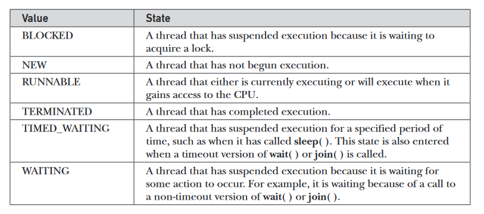

# Java Revision for Interviews

Reference materials
- Java - The Complete Reference [9th Edition]


## Plan - Cover the following topics
### Easy Topics
- Java Buzzwords ✅
- Three OOP principles✅
	- Inheritance
	- Encapsulation
	- Polymorphism
	- Abstraction
- primitive types in java✅
- type conversion and casting✅
- Java arrays(initializing and declaration)✅
	- 2-d arrays
- Operators (just skim through the operators)✅
- control flow statements✅
	- for-each loop
- Class Fundamentals✅
	- what is a class?
	- what are objects?
	- declaring a class
	- what are methods
	- constructor
- **this** keyword✅
	- Instance Variable Hiding
- garbage collection✅
- finalize() method✅
- method overloading✅
- constructor overloading✅
- **static** keyword✅
- access control✅
- **final** keyword✅
- Nested and inner classes✅
- using command line arguments✅
- variable length argument✅
- inheritance basics✅
- golden rule - super class variable can access a subclass object✅
- types of inheritance supported in Java✅
- use of **super** in inheritance✅
- method overriding✅
- Dynamic Method Dispatch✅
- Abstract Classes✅
- use of **final** with inheritance✅
- **Object** class✅
- Packages✅
- Interfaces✅
	- **static** methods in an interfaces
- Exception handling✅
	- try-catch
	- nested try statements
	- throw
	- throws
	- finally
- Creating your own exception subclass✅
- chained exceptions✅

### Moderate Topics
- Multithreaded Programming(Traditional)
- Multithreading using fork/join(Chapter 28)
- Enumerations, Autoboxing and Annotations
- Generics
- Lambda Expressions


### Java Library Topics
Try to go through the entire library and make a note of useful classes and features.


## Notes
- Java buzzwords
	- simple
	- object oriented - not purely OO, becuase has primitive types
	- robust - provides reliability, it is strictly typed, handles memory management, and exception handling
	- multithreaded - provides support for multithreaded architectures
	- architecture neutral - JVM allows "write once, run anywhere, anytime, forever"
	- integrated and high performance - although it is cross platform provides good performance. Java is a compiled programming language, but rather than compile straight to executable machine code, it compiles to an intermediate binary form called JVM byte code. The byte code is then compiled and/or interpreted to run the program.
	- distributed - designed to work on distributed environent. Handles TCP/IP protocols. Remote Method Invocation supported bu Java, allows programs to invoke methods across the network.
	- Dynamic
- process oriented programming(C/C++), code acting on data
- object oriented programming, data controlling access to code
- **Abstraction**: we manage complexity through abstraction. e.g. We do not think of a car as a set of tens of thousands of parts, but as a well-defined object with its own unique behaviour. This allows us to drive to our workplace(or anywhere else for that matter), without being overwhelmed by the complexity. One way to manage complexity is through heirarchial abstraction
- OOP Principle 1, **Encapsulation**: Mechanism that binds together code and the data it manipulates and keeps both safe from outside interference and misuse. One way to think about encapsulation is as a protective wrapper that prevents the code and data from being arbitrarily accessed by other code defined outside the wrapper. To relate this to the real world, consider the automatic transmission on an automobile. It encapsulates hundreds of bits of information about your engine, such as how much you are accelerating, the pitch of the surface you are on, and the position of the shift lever. You, as the user, have only one method of affecting this complex encapsulation: by moving the gear-shift lever. You can’t affect the transmission by using the turn signal or windshield wipers, for example. Thus, the gear-shift lever is a well-defined (indeed, unique) interface to the transmission. Further, what occurs inside the transmission does not affect objects outside the transmission. ecause an automatic transmission is encapsulated, dozens of car manufacturers can implement one in any way they please. However, from the driver’s point of view, they all work the same. In Java, the basis of encapsulation is the class. (_Also talk about how Java implements encapsulation, using the public, private, protected keywords and class).
- A good example of abstraction and encapsulation: Suppose you go to an automatic cola vending machine and request for a cola. The machine processes your request and gives the cola.
	- Here automatic cola vending machine is a class. It contains both data i.e. Cola can and operations i.e. service mechanism and they are wrapped/integrated under a single unit Cola Vending Machine. This is called Encapsulation.
	- You need not know how the machine is working. This is called Abstraction.
	- You can interact with cola can only through service mechanism. You cannot access the details about internal data like how much cans it contains, mechanism etc. This is Data Hiding.
	- You cannot pick the cola can directly. You request for cola through proper instructions and request mechanism (i.e. by paying amount and filling request) and get that cola only through specified channel. This is message passing.
- OOP Principle 2, **Inheritance**: Inheritance is the process by which one object acquires the properties of another object. (Allows reuse of code). It is important because it supports the concept of heirarchial classification. For eg. A Golden Retriever is a breed of dog, which is in turn a mammal, which is in turn an animal. Without the use of hierarchies, each object would need to define all of its characteristics explicitly. However, by use of inheritance, an object need only define those qualities that make it unique within its class. It can inherit its general attributes from its parent. Thus, it is the inheritance mechanism that makes it possible for one object to be a specific instance of a more general case. 
- OOP Principle 3, **Polymorphism**: Polymorphism(meaning, "many forms"), is a feature that allows one interface to be used for a general class of actions. The specific action is determined by the exact nature of the situation. Consider a stack (which is a last-in, first-out list). You might have a program that requires three types of stacks. One stack is used for integer values, one for floating-point values, and one for characters. The algorithm that implements each stack is the same, even though the data being stored differs. In a non–object-oriented language, you would be required to create three different sets of stack routines, with each set using different names.However, because of polymorphism, in Java you can specify a general set of stack routines that all share the same names. Polymorphism is defined by “one interface, multiple methods.” Extending the dog analogy, a dog’s sense of smell is polymorphic. If the dog smells a cat, it will bark and run after it. If the dog smells its food, it will salivate and run to its bowl. The same sense of smell is at work in both situations. The difference is what is being smelled, that is, the type of data being operated upon by the dog’s nose!
- _main()_ method is declared public because it is called by code outside(JVM) of its class when the program begins.
- Java is a **strongly typed** language, i.e. every variable and expressions have a type and that type is explicitly defined. All assignments are checked for type compatibility.
- Primitive types: Integers(byte, short, int, long), Floating Point(float, double), Characters(char), Boolean. 
- All primitive types in java have a strictly defined range(unlike C/C++ which depends on the environment the programs are run)
- Automatic type conversion: When one type of data is assigned to another type of variable, automatic type conversion takes place, when the following two condition are met
	1. the two types are compatible
	2. destination type is larger than source type<br>
When these two conditions are met, a widening conversion takes place. For widening conversions, the numeric types, including integer and floating-point types, are compatible with each other. However, there are no automatic conversions from the numeric types to char or boolean. Also, char and boolean are not compatible with each other
- Casting incompatible types(narrowing conversion): To create a conversion between two incompatible types, you must use a **cast**. A cast is
simply an explicit type conversion. It has this general form: 
	`(target-type) value`
Example - the following casts an integer to byte
	```java
	   int a;
	   byte b;
       // …
	   b = (byte) a;
	```
- casting a float to int will cause truncation
- arrays are group of variables of the same type referred by a common name. 
	- `int month_days[]` declares an array, but at this point no array actually exists
	- To link the array with actual physical array of integers we allocate memory to it using **new** keyword. This is how its done. `month_days = new int[12]`.
	- All arrays in java are dynamically allocated
	- [Arrays Program](https://github.com/zed1025/java-notes/blob/master/arrays.java)
	- declaring 2-d arrays. `int matrix[][] = new int[3][3];`. We can even declare the second dimension manually.
		```
		int twoD[][] = new int[4][];
		twoD[0] = new int[1];
		twoD[1] = new int[2];
		twoD[2] = new int[3];
		twoD[3] = new int[4];
		```
- Java does not support pointers because of security reasons.  Java cannot allow pointers, because doing so would allow Java programs to breach the firewall between the Java execution environment and the host computer. (Remember, a pointer can be given any address in memory—even addresses that might be outside the Java run-time system.)
- The _expression_ in switch statements must be one of the following types - byte, short, int, char, enumeration, 
- Nested swithc statements are possible in Java
- Difference between switch and if-else statements: switch can only test for equality, whereas if-else can evaluate any boolean expression. 
- A switch statement is generally more effifient than nested **if**s.  When it compiles a switch statement, the Java compiler will inspect each of the case constants and create a “jump table” that it will use for selecting the path of execution depending on the value of the expression. Therefore, if you need to select among a large group of values, a switch statement will run much faster than the equivalent logic coded using a sequence of if-elses. 
- In java **,** is not an operator, it is a seperator
- For-each loop: It has the following syntax `for(type itr-var : collection) statement-block`. One thing to note about for-each loops, is that they are just for iterating the entire array, we cannot change array elements using this loop
	```java
	int nums[] = { 1, 2, 3, 4, 5, 6, 7, 8, 9, 10 };
	for(int x: nums) {
	System.out.print(x + " ");
	x = x * 10; // no effect on nums
	}
	```
	- [For-each Program](https://github.com/zed1025/java-notes/blob/master/for_each.java)
- Uses of **break** statement
	- exiting loops
	- in switch statements
	- as a form of GOTO
- classes define a new data-type. Once defined we can use this new type to create objects of that type. 
- class is a template for an object. An object is instance of class
- The **new** operator dynamically allocates memory for an objevt and returns a reference to it.
- In java all objects are dynamically allocated
- A constructor defines what happens when an object of a class is created.
- **new** allocated memory for an object during run-time
- `Box myBox;`, here a reference variable of type Box is created. `myBox = new Box();`, here memory is allocated to the reference variable. [Understanding reference variables](https://github.com/zed1025/java-notes/blob/master/understanding_reference_variables.java). When you assign one object reference variable to another object reference variable, you are not creating a copy of the object, you are only making a copy of the reference.
- Facts about **constructors**
  - initializes an object immediately upon creation
  - it has the same name as the class
  - syntactically similar to a method
  - they do not have any return type, not even void, this is because the implicit return type of a class' constructor is the class itself. [Box With Constructor](https://github.com/zed1025/java-notes/blob/master/box_with_constructor.java)
- uses of **this** keyword
  - __this__ can be used inside any method to refer to the current method
  - this is always a reference to the object on which the method was invoked
- Instance variable hiding. [Instance Variable Hiding](https://github.com/zed1025/java-notes/blob/master/instance_variable_hiding.java)
  - when a local variable has the same name as an instance variable, the local variable hides the instance variable.
- How **garbage collection**(GC) works in java?
  -  when no references to an object exist, that object is assumed to be no longer needed, and the memory occupied by the object can be reclaimed.
  -  There is no explicit need to destroy objects as in C++
  -  the GC is invoked sporadically and not at any particular or regular intervals. You do not need to worry about GC while writing Java programs
  -  the **finalize()** methods is used to performs some action befor the object is destroyed. 
     -  By using finalization, you can define specific actions that will occur when an object is just about to be reclaimed by the garbage collector.
     -  To add a finalizer to a class, you simply define the finalize( ) method. The Java run time calls that method whenever it is about to recycle an object of that class. Inside the finalize( )method, you will specify those actions that must be performed before an object is destroyed.
     -  It is important to understand that finalize( ) is only called just prior to garbage collection. It is not called when an object goes out-of-scope
     -  This means that you cannot know when—or even if—finalize( ) will be executed.  Therefore, your program should provide other means of releasing system resources, etc., used by the object. It must not rely on finalize( ) for normal program operation.
     -  [Finalize example](https://github.com/zed1025/java-notes/blob/master/finalize_example.java)
     -  The finalize( ) method only approximates the function of a destructor. 
-  Method Overloading
   -  2 or more methods with the same name but different parameter declarations
   -  Java uses the type and/or number of arguments as its guide to determine which version of the overloaded method to actually call
   -  the return type alone is insufficient to distinguish two versions of a methods[Method Overloading 1](https://github.com/zed1025/java-notes/blob/master/method_overloading_1.java)
   -  Method overloading supports **polymorphism** because it is one way that Java implements the “one interface, multiple methods” paradigm. 
-  Parameter passing in java
   -  When you pass a primitive type to a method, it is passed by value. 
   -  When you pass an object to a method, those objects are passed by what is effectively call-by-reference. This is because when you create a variable of a class type, you are only creating a reference to an object. [Call by reference](https://github.com/zed1025/java-notes/blob/master/call_by_reference.java)
-  Java supports recursion.[Tower of Hanoi](https://github.com/zed1025/java-notes/blob/master/tower_of_hanoi.java)
-  **Access Control**
   -  Encapsulation provides _access control_
   -  Through encapsulation, you can control what parts of a program can access the members of a class. 
   -  How a member can be accessed is determined by the access modifier attached to its declaration. Java supplies a rich set of access modifiers. Some aspects of access control are related mostly to inheritance or packages. (A package is, essentially, a grouping of classes.) These parts of Java’s access control mechanism will be discussed later. Here, let’s begin by examining access control as it applies to a single class. Once you understand the fundamentals of access control, the rest will be easy.
   -  `public` modifier
      -  When a member of a class is modified by public, then that member can be accessed by any other code. 
      -  When no access modifier is used, then by default the member of a class is public within its own **package**, but cannot be accessed outside of its **package**.
   -  `private` modifier
      -  When a member of a class is specified as private, then that member can only be accessed by other members of its class. 
-  `static` members. [Using static](https://github.com/zed1025/java-notes/blob/master/using_static.java)
   -  a class member that will be used independently of any object of that class.
   -  To create such a member, precede its declaration with the keyword `static`.
   -  You can declare both methods and variables to be static.   
   -  The most common example of a static member is main( ). main( ) is declared as static because it must be called before any objects exist.
   -  **Instance variables declared as static are, essentially, global variables. When objects of its class are declared, no copy of a static variable is made. Instead, all instances of the class share the same static variable.**
   -  Methods declared static have the following restrictions
      -  They can only directly call other static methods.`using_static.java:20: error: non-static method hello() cannot be referenced from a static context`
      -  They can only directly access static data. `using_static.java:19: error: non-static variable c cannot be referenced from a static context`
      -  They cannot refer to `this` or `super` in any way. 
   -  If you need to do computation in order to initialize your static variables, you can declare a static block that gets executed exactly once, when the class is first loaded.
   -  Outside of the class in which they are defined, static methods and variables can be used independently of any object. To do so, you need only specify the name of their class followed by the dot operator. For example, if you wish to call a static method from outside its class, you can do so using the following general form: `classname.method( )`. A static variable can be accessed in the same way—by use of the dot operator on the name of the class. This is how Java implements a controlled version of global methods and global variables.
-  `final`
   -  A field can be declared as final. Doing so prevents its contents from being modified, making it, essentially, a constant.
   -  you must initialize a final field when it is declared
   -  both method parameters and local variables can be declared final. Declaring a parameter final prevents it from being changed within the method. Declaring a local variable final prevents it from being assigned a value more than once.
   -  use of final with methods is related to inheritance.
   -  
-  Arrays in java are implemented as objects. 
   -  `arrName.length` gives the length of the array. the value of lengthhas nothing to do with the number of elements that are actually in use. It only reflects the number of elements that the array is designed to hold
-  Nested and Inner classes
   -  The Java programming language allows you to define a class within another class. Such a class is called a nested class and is illustrated here:
		```
		class OuterClass {
			...
			class NestedClass {
				...
			}
		}
		```
   - Nested classes are divided into two categories: static and non-static. Nested classes that are declared static are called static nested classes. Non-static nested classes are called inner classes. 
		```
		class OuterClass {
			...
			static class StaticNestedClass {
				...
			}
			class InnerClass {
				...
			}
		}
		```
   - The most important type of nested class is the inner class. An inner class is a non-static nested class. It has access to all of the variables and methods of its outer class and may refer to them directly in the same way that other non-static members of the outer class do. [Inner Class](https://github.com/zed1025/java-notes/blob/master/inner_class.java)
   - A static nested class is one that has the static modifier applied. Because it is static, it must access the non-static members of its enclosing class through an object. That is, it cannot refer to non-static members of its enclosing class directly. Because of this restriction, static nested classes are seldom used. [Static nested class](https://github.com/zed1025/java-notes/blob/master/static_nested_class.java)
   - Uses of nested classes. [link](https://docs.oracle.com/javase/tutorial/java/javaOO/nested.html)
     1. **It is a way of logically grouping classes that are only used in one place**: If a class is useful to only one other class, then it is logical to embed it in that class and keep the two together. Nesting such "helper classes" makes their package more streamlined.
     2. **It increases encapsulation**: Consider two top-level classes, A and B, where B needs access to members of A that would otherwise be declared private. By hiding class B within class A, A's members can be declared private and B can access them. In addition, B itself can be hidden from the outside world.
     3. **It can lead to more readable and maintainable code**: Nesting small classes within top-level classes places the code closer to where it is used.
     4. Useful in event handling
  - Most commounly inner classes are declared as members within an outer class scope, but it is possible to define inner classes within any block scope. For example, you can define a nested class within the block defined by a method or even within the body of a for loop. [Inner Class Block Scope](https://github.com/zed1025/java-notes/blob/master/inner_class_block_scope.java)
- [Why are java strings immutable?](https://javarevisited.blogspot.com/2010/10/why-string-is-immutable-or-final-in-java.html)
- _Some_ useful string methods
  - `boolean equals(secondStr)`, You can test two strings for equality
  - `int length( )`, You can obtain the length of a string 
  - `char charAt(index)`, You can obtain the character at a specified index within a string
- Using **command-line-arguments** in java
  - used to pass information into a program when you run it
  - To access the command-line arguments inside a Java program is quite easy—they are stored as strings in a String array passed to the args parameter of main( )
  - The first command-line argument is stored at args[0], the second at args[1], and so on.
  - All command-line arguments are passed as strings. You must convert numeric values to their internal forms manually
- Variable length argument
  -  creation of methods that need to take a variable number of arguments. 
  -  This feature is called _varargs_ and it is short for _variable-length arguments_. A method that takes a variable number of arguments is called a _variable-arity method_, or simply a _varargs method_.
  -  eg. `printf()` method in Java.io library uses varargs
  -  A variable-length argument is specified by three periods `(...)`. For example, here is how vaTest( ) is written using a vararg `static void vaTest(int ... v) {`.
  -  [Variable Argument 1](https://github.com/zed1025/java-notes/blob/master/var_len_arg1.java). This syntax tells the compiler that vaTest( ) can be called with zero or more arguments. As a result, v is implicitly declared as an array of type int[ ]. Thus, inside vaTest( ), v is accessed using the normal array syntax.
  -  A method can have “normal” parameters along with a variable-length parameter. However, the variable-length parameter must be the last parameter declared by the method. E.g. `int doIt(int a, int b, double c, int ... vals) {`
  -  There is one more restriction to be aware of: **there must be only one varargs parameter**. For example, this declaration is also invalid: `int doIt(int a, int b, double c, int ... vals, double ... morevals) { // Error!`.
  -  You can overload a method that takes a variable-length argument. [Overloaded Varargs](https://github.com/zed1025/java-notes/blob/master/var_len_arg2.java)
  -  A varargs method can also be overloaded by a non-varargs method. 
- Inheritance intro
  - allows creation of hierarchical classifications
  - Using inheritance, you can create a general class that defines traits common to a set of related items. This class can then be inherited by other, more specific classes, each adding those things that are unique to it.
  - In the terminology of Java, a class that is inherited is called a _superclass_. The class that does the inheriting is called a _subclass_.
  - Therefore, a subclass is a specialized version of a superclass.
- To inherit a class, you simply incorporate the definition of one class into another by using the `extends` keyword. [Inheritance Basic 1](https://github.com/zed1025/java-notes/blob/master/inheritance1.java)
- **Java does not support the inheritance of multiple superclasses into a single subclass**. You can, create a hierarchy of inheritance in which a subclass becomes a superclass of another subclass. However, no class can be a superclass of itself.
- Although a subclass includes all of the members of its superclass, it cannot access those members of the superclass that have been declared as `private`.
- A class member that has been declared as private will remain private to its class. It is not accessible by any code outside its class, including subclasses.
- A _Superclass_ variable can reference a _Subclass_ object
  - A reference variable of a superclass can be assigned a reference to any subclass derived from that superclass.
  - [Reference Demo](https://github.com/zed1025/java-notes/blob/master/RefDemo.java)
    - It is important to understand that it is the type of the reference variable—not the type of the object that it refers to—that determines what members can be accessed. That is, when a reference to a subclass object is assigned to a superclass reference variable, you will have access only to those parts of the object defined by the superclass. 
    - This is why plainboxcan’t access weight even when it refers to a BoxWeight object.
- using `super`
  - Whenever a subclass needs to refer to its immediate superclass, it can do so by use of the keyword `super`.
  - `super` has two general forms.
    1. first calls the superclass’ constructor.
    2. second is used to access a member of the superclass that has been hidden by a member of a subclass.
  - A subclass can call a constructor defined by its superclass by use of the following form of super: 
		```
		super(arg-list);
		``` 
    - arg-list specifies any arguments needed by the constructor in the superclass. super( )must always be the first statement executed inside a subclass’ constructor.
		```
		// BoxWeight now uses super to initialize its Box attributes.
		class BoxWeight extends Box {  
			double weight; // weight of box  

			// initialize width, height, and depth using super()  
			BoxWeight(double w, double h, double d, double m) {    
				super(w, h, d); // call superclass constructor    
				weight = m;  
			}
		}
		```
    - Since constructors can be overloaded, super( ) can be called using any form defined by the superclass. The constructor executed will be the one that matches the arguments. 
  - Second use of super
    - The second form of super acts somewhat like this, except that it always refers to the superclass of the subclass in which it is used.
    - This usage has the following general form: `super.member`. `member` can be either a method or an instance variable.
    - This second form of super is most applicable to situations in which member names of a subclass hide members by the same name in the superclass. [Subclass Hiding Superclass Members](https://github.com/zed1025/java-notes/blob/master/subclass_hiding_super_mem.java)
- [Why Java doesnt support multiple inheritance?](https://stackoverflow.com/a/2515675)
- [Types of inheritance in java](https://beginnersbook.com/2013/05/java-inheritance-types/)
  - Single Inheritance
  - Multilevel Inheritance
  - Heirarchial Inheritance
  - Hybrid Inheritance
  - Multiple Inheritance (**NOT SUPPORTED**)
- Order of evaluation of constructors
  - When a class hierarchy is created, in what order are the constructors for the classes that make up the hierarchy executed? 
  - For example, given a subclass called B and a superclass called A, is A’s constructor executed before B’s, or vice versa?
  - The answer is that in a class hierarchy, constructors complete their execution in order of derivation, from superclass to subclass.
  -  Further, since super( ) must be the first statement executed in a subclass’ constructor, this order is the same whether or not super( ) is used. If super( ) is not used, then the default or parameterless constructor of each superclass will be executed.
  -  [Constructor Execution order](https://github.com/zed1025/java-notes/blob/master/constructor_execution_order.java)
- Method Overriding
  - In a class hierarchy, when a method in a subclass has the same name and type signature as a method in its superclass, then the method in the subclass is said to override the method in the superclass.
  - When an overridden method is called from within its subclass, it will always refer to the version of that method defined by the subclass. The version of the method defined by the superclass will be hidden.
  - [Method Overriding 1](https://github.com/zed1025/java-notes/blob/master/method_overriding1.java)
  - If you wish to access the superclass version of an overridden method, you can do so by using super. For example, in this version of B, the superclass version of show( ) is invoked within the subclass’ version. This allows all instance variables to be displayed.
		```
		class B extends A {  
			int k;  
			B(int a, int b, int c) {    
				super(a, b);    
				k = c;  
			}  
			
			void show() {    
				super.show(); // this calls A's show()    
				System.out.println("k: " + k);  
			}
		}
		```
  - Method overriding occurs only when the names and the type signatures of the two methods are identical. If they are not, then the two methods are simply overloaded. [Overriding Overloading](https://github.com/zed1025/java-notes/blob/master/overriding_overloading.java)
- Dynamic Method Dispatch
  - Method overriding forms the basis for one of Java’s most powerful concepts: dynamic method dispatch.
  - Dynamic method dispatch is the mechanism by which a call to an overridden method is resolved at run time, rather than compile time. Dynamic method dispatch is important because this is how Java implements **run-time polymorphism**.
  - _RECALL: a superclass reference variable can refer to a subclass object_. 
  - When an overridden method is called through a superclass reference, Java determines which version of that method to execute based upon the type of the object being referred to at the time the call occurs. Thus, this determination is made at run time. 
  - When different types of objects are referred to, different versions of an overridden method will be called. In other words, it is the type of the object being referred to (not the type of the reference variable) that determines which version of an overridden method will be executed. Therefore, if a superclass contains a method that is overridden by a subclass, then when different types of objects are referred to through a superclass reference variable, different versions of the method are executed.
  - [Dynamic Methods Dispatch](https://github.com/zed1025/java-notes/blob/master/dynamic_method_dispatch.java)
  - [Dynamic Methods Dispatch Practical](https://github.com/zed1025/java-notes/blob/master/dynamic_method_dispatch_practical.java)
  - Readers familiar with C++ or C# will recognize that overridden methods in Java are similar to **virtual functions** in those languages.
- **Abstract** Class
  - There are situations in which you will want to define a superclass that declares the structure of a given abstraction without providing a complete implementation of every method. 
  - That is, sometimes you will want to create a superclass that only defines a generalized form that will be shared by all of its subclasses, leaving it to each subclass to fill in the details. Such a class determines the nature of the methods that the subclasses must implement. 
  - You can require that certain methods be overridden by subclasses by specifying the `abstract` type modifier. Syntax: `abstract type name(parameter-list);`.
  - Any class that contains one or more abstract methods must also be declared abstract.
  - There can be no objects of an abstract class. That is, an abstract class cannot be directly instantiated with the new operator. 
  - Also, you cannot declare abstract constructors, or abstract static methods. 
  - Any subclass of an abstract class must either implement all of the abstract methods in the superclass, or be declared abstract itself.
  - Although abstract classes cannot be used to instantiate objects, they can be used to create object references, because Java’s approach to run-time polymorphism is implemented through the use of superclass references. 
  - [Abstract Class Example 1](https://github.com/zed1025/java-notes/blob/master/abstract_class1.java)
  - [Practical Example of Abstract class](https://github.com/zed1025/java-notes/blob/master/abstract_class_practical.java)
- Using `final` with inheritance
  - reacall the use of `final` discussed earlier: used to create named constants
  - The other two uses are discussed here
    - used to prevent method overriding:  To disallow a method from being overridden, specify final as a modifier at the start of its declaration. Methods declared as final cannot be overridden. 
		```
		class A {
		final void meth() {
			System.out.println("This is a final method.");
		}
		}

		class B extends A {
		void meth() { // ERROR! Can't override.
			System.out.println("Illegal!");
		}
		}
		```
      - Methods declared as final can sometimes provide a performance enhancement: The compiler is free to inline calls to them because it “knows” they will not be overridden by a subclass. When a small final method is called, often the Java compiler can copy the bytecode for the subroutine directly inline with the compiled code of the calling method, thus eliminating the costly overhead associated with a method call. Inlining is an option only with final methods. Normally, Java resolves calls to methods dynamically, at run time. This is called **late binding**. However, since final methods cannot be overridden, a call to one can be resolved at compile time. This is called **early binding**.
    - using `final` to prevent inheritance: Sometimes you will want to prevent a class from being inherited. To do this, precede the class declaration with final. Declaring a class as final implicitly declares all of its methods as final, too. 
      - As you might expect, it is illegal to declare a class as both abstract and final since an abstract class is incomplete by itself and relies upon its subclasses to provide complete implementations.
		```
		final class A {
		// ...
		}

		// The following class is illegal.
		class B extends A { // ERROR! Can't subclass A
		// ...
		}

		```
- All classes in Java are subclasses of the `Object` class. 
  - This means that a reference variable of type Object can refer to an object of any other class. 
  - Also, since arrays are implemented as classes, a variable of type Object can also refer to any array.
- **Packages** Intro
  - packages are containers for classes
  - They are used to keep the class name space compartmentalized.
  - For example, a package allows you to create a class named List, which you can store in your own package without concern that it will collide with some other class named List stored elsewhere.
  - The package is both a naming and a visibility control mechanism. 
  - You can define classes inside a package that are not accessible by code outside that package. You can also define class members that are exposed only to other members of the same package. 
  - To create a package is quite easy: simply include a `package` command as the first statement in a Java source file.  Any classes declared within that file will belong to the specified package. 
  - The package statement defines a name space in which classes are stored. If you omit the package statement, the class names are put into the _default_ package, which has no name.
  - Syntax: `package MyPackage;`
  - Java uses file system directories to store packages.
  - You can create a hierarchy of packages. To do so, simply separate each package name from the one above it by use of a period. The general form of a multileveled package statement is shown here: `package pkg1[.pkg2[.pkg3]]`;
  - Finding packages: How does the Java run-time system know where to look for packages that you create?
    - Java run-time system searches the current working directory.Thus, if your package is in a subdirectory of the current directory, it will be found.
    - Second, you can specify a directory path or paths by setting the CLASSPATH environmental variable.
    - Third, you can use the -classpath option with javaand javac to specify the path to your classes.
  - See page 190, 191 to see how to run programs that use package
  - 
- **Interface** Intro
  - Using the keyword interface, you can fully abstract a class’ interface from its implementation.
  - That is, _using interface, you can specify what a class must do, but not how it does it_
  - syntactically similar to classes but
    -  they lack instance variables
    -  their methods are declared without any body.
    -  One class can implement multiple interfaces
    -  To implement an interface, a class must provide the complete set of methods required by the interface. However, each class is free to determine the details of its own implementation. 
    -  By providing the interface keyword, Java allows you to fully utilize the **“one interface, multiple methods”** aspect of _polymorphism_.
    -  Interface Syntax
      ```
      access interface name {
        return-type method-name1(parameter-list);
        return-type method-name2(parameter-list);

        type final-varname1 = value;
        type final-varname2 = value;        
        //...
        return-type method-nameN(parameter-list);
        type final-varnameN = value;
      }
      ```
      - When no access modifier is included, then default access results
      - Each class that includes such an interface must implement all of the methods.
    - Beginning with JDK 8, it is possible to add a _default implementation_ to an interface method.
    - variables can be declared inside of interface declarations. They are implicitly final and static, meaning they cannot be changed by the implementing class. They must also be initialized. All methods and variables are implicitly public.
  - implementing interfaces
    - use the `implements` clause
    - syntax:
      ```
      class classname [extends superclass] [implements interface [,interface...]] {    
        // class-body
      }
      ```
    - example
      ```
      interface Callback {
        void callback(int param);
      }
      ```
    - If a class implements more than one interface, the interfaces are separated with a comma.
    - If a class implements two interfaces that declare the same method, then the same method will be used by clients of either interface. _The methods that implement an interface must be declared_ `public`. Also, the type signature of the implementing method must match exactly the type signature specified in the interface definition.\
    - **When you implement an interface method, it must be declared as public.**
    - It is both permissible and common for classes that implement interfaces to define additional members of their own. 
    - example: implementing interface
      ```
      class Client implements Callback {
        // Implement Callbacks' interface, method must be public
        public void callback(int p) {
          System.out.println("callback called with " + p);
        }

        //we can also add non interface methods
        void nonInterfaceMethod() {
          System.out.println("Classes that implement interfaces " +"may also define other members, too.");
        }
      }
      ```
  - You can access implementations through interface reference
  - When you call a method through one of these references, the correct version will be called based on the actual instance of the interface being referred to. This is one of the key features of interfaces. The method to be executed is looked up dynamically at run time, allowing classes to be created later than the code which calls methods on them. This process is similar to using a superclass reference to access a subclass object.
  - The following example calls the callback( ) method via an interface reference variable:
    ```
    class TestIface {
      public static void main(String[] args) {
        Callback c = new Client();
        c.callback(42);
      }
    }
    ```
    - Although c can be used to access the callback( ) method, it cannot access any other members of the Client class. An interface reference variable has knowledge only of the methods declared by its interface declaration. Thus, c could not be used to access nonIfaceMeth( ) since it is defined by Client but not Callback.
- If a class includes an interface but does not fully implement the methods required by that interface, then that class must be declared as `abstract`.
- **Nested Interface**
  - An interface can be declared a member of a class or another interface. Such an interface is called a member interface or a nested interface. A nested interface can be declared as public, private, or protected. This differs from a top-level interface, which must either be declared as public or use the default access level, as previously described. When a nested interface is used outside of its enclosing scope, it must be qualified by the name of the class or interface of which it is a member. Thus, outside of the class or interface in which a nested interface is declared, its name must be fully qualified.
  - [Nested Interface](https://github.com/zed1025/java-notes/blob/master/nested_interface.java)
- One interface can inherit another by use of the keyword extends. 
  - The syntax is the same as for inheriting classes.
  - When a class implements an interface that inherits another interface, it must provide implementations for all methods required by the interface inheritance chain. 
  - [Inheritance of Interfaces](https://github.com/zed1025/java-notes/blob/master/extending_interfaces.java)
- Default Interface Methods
  - A default method lets you define a default implementation for an interface method. In other words, by use of a default method, it is now possible for an interface method to provide a body, rather than being abstract. During its development, the default method was also referred to as an extensionmethod, and you will likely see both terms used
  - It is important to point out that the addition of default methods does not change a key aspect of interface: its _inability_ to maintain state information.
  - An interface still cannot have instance variables, for example
  -  the defining difference between an interface and a class is that a class can maintain state information, but an interface cannot
  -  An interface default method is defined similar to the way a method is defined by a class. The primary difference is that the declaration is preceded by the keyword `default`. 
    ```
    public interface MyIF { 
      // This is a "normal" interface method declaration. 
      // It does NOT define a default implementation. 
      int getNumber(); 
    
      // This is a default method. Notice that it provides 
      // a default implementation. 
      default String getString() { 
        return "Default String"; 
      } 
    }
    ```
  - We can use this interface as follows
    ```
    // Implement MyIF. 
    class MyIFImp implements MyIF { 
      // Only getNumber() defined by MyIF needs to be implemented. 
      // getString() can be allowed to default. 
      public int getNumber() { 
        return 100; 
      } 
    }
    ```
- There is no workaround to implementing multiple inheritance in Java even using interfaces
- Static Interface Methods
  - Like static methods in a class, a static method defined by an interface can be called independently of any object. Thus, no implementation of the interface is necessary, and no instance of the interface is required, in order to call a static method. 
  - Instead, a static method is called by specifying the interface name, followed by a period, followed by the method name. Here is the general form: `InterfaceName.staticMethodName`.
  - static interface methods are _not inherited_ by either an implementing class or a subinterface
- Exception Handling Basics
  - An exception is an abnormal condition that arises in a code sequence at run time.
  - an exception is a run-time error. 
  - A Java exception is an object that describes an exceptional (that is, error) condition that has occurred in a piece of code.
  - When an exceptional condition arises, an object representing that exception is created and _thrown_ in the method that caused the error.
  - That method may choose to handle the exception itself, or pass it on. Either way, at some point, the exception is _caught_ and processed.
  - Java exception handling is managed via five keywords: `try`, `catch`, `throw`, `throws`, and `finally`.
  - Briefly, here is how they work. Program statements that you want to monitor for exceptions are contained within a try block. If an exception occurs within the try block, it is thrown. Your code can catch this exception (using catch) and handle it in some rational manner. System-generated exceptions are automatically thrown by the Java run-time system. To manually throw an exception, use the keyword throw. Any exception that is thrown out of a method must be specified as such by a throws clause. Any code that absolutely must be executed after a try block completes is put in a finally block.
- Exception Types
  - All exception types are subclasses of the built-in class **Throwable**. 
  - Immediately below Throwable are two subclasses that partition exceptions into two distinct branches.
    - One branch is headed by Exception. This class is used for exceptional conditions that user programs should catch. This is also the class that you will subclass to create your own custom exception types. There is an important subclass of Exception, called RuntimeException. Exceptions of this type are automatically defined for the programs that you write and include things such as division by zero and invalid array indexing.
    - The other branch is topped by Error, which defines exceptions that are not expected to be caught under normal circumstances by your program. Exceptions of type Error are used by the Java run-time system to indicate errors having to do with the run-time environment, itself. Stack overflow is an example of such an error.(NOT COVERED HERE)
  - 
- Benifits of handling exceptions by yourself
  - First, it allows you to fix the error
  - Second, it prevents the program from automatically terminating. 
- To guard against and handle a run-time error, simply enclose the code that you want to monitor inside a try block. Immediately following the `try` block, include a `catch` clause that specifies the exception type that you wish to catch. [Exceptions 1](https://github.com/zed1025/java-notes/blob/master/exceptions1.java)
  - Notice that the call to println( ) inside the try block is never executed. Once an exception is thrown, program control transfers out of the try block into the catch block.
  - Once the catch statement has executed, program control continues with the next line in the program following the entire try / catch mechanism.
- In some cases, more than one exception could be raised by a single piece of code. To handle this type of situation, you can specify two or more catch clauses, each catching a different type of exception. When an exception is thrown, each catch statement is inspected in order, and the first one whose type matches that of the exception is executed. After one catch statement executes, the others are bypassed, and execution continues after the try / catch block.
- The `try` statement can be nested. 
- a `try` statement can be inside the block of another try. Each time a try statement is entered, the context of that exception is pushed on the stack. If an inner try statement does not have a catch handler for a particular exception, the stack is unwound and the next try statement’s catch handlers are inspected for a match. This continues until one of the catch statements succeeds, or until all of the nested trystatements are exhausted. If no catch statement matches, then the Java run-time system will handle the exception. [Nested try](https://github.com/zed1025/java-notes/blob/master/exceptions2.java)
- **throw**: So far, you have only been catching exceptions that are thrown by the Java run-time system. However, it is possible for your program to throw an exception explicitly, using the throwstatement. The general form of throw is shown here: `throw ThrowableInstance;`.
  - ThrowableInstance must be an object of type Throwable or a subclass of Throwable. Primitive types, such as int or char, as well as non-Throwable classes, such as String and Object, cannot be used as exceptions. 
  - There are two ways you can obtain a Throwableobject: using a parameter in a catch clause or creating one with the new operator.
  - The flow of execution stops immediately after the throw statement; any subsequent statements are not executed. The nearest enclosing try block is inspected to see if it has a catch statement that matches the type of exception. If it does find a match, control is transferred to that statement. If not, then the next enclosing try statement is inspected, and so on. If no matching catch is found, then the default exception handler halts the program and prints the stack trace. [Throw demo](https://github.com/zed1025/java-notes/blob/master/throw_demo.java)
    - This program gets two chances to deal with the same error. First, main( ) sets up an exception context and then calls demoproc( ). The demoproc( ) method then sets up another exception-handling context and immediately throws a new instance of NullPointerException, which is caught on the next line. The exception is then rethrown. 
- **throws**: If a method is capable of causing an exception that it does not handle, it must specify this behavior so that callers of the method can guard themselves against that exception. 
  - You do this by including a throws clause in the method’s declaration. A throws clause lists the types of exceptions that a method might throw. 
  - This is necessary for all exceptions, except those of type Error or RuntimeException, or any of their subclasses. All other exceptions that a method can throw must be declared in the throws clause. If they are not, a compile-time error will result.
  - This is the general form of a method declaration that includes a `throws` clause:
    ```
    type method-name(parameter-list) throws exception-list{   
      // body of method
    }
    ```
  - _exception-list_ is a comma-separated list of the exceptions that a method can throw.
  - [Throws Demo](https://github.com/zed1025/java-notes/blob/master/throws_demo.java)
  - [Throws Demo 2](https://github.com/zed1025/java-notes/blob/master/throws_demo2.java)
- **finally**: finally creates a block of code that will be executed after a try /catch block has completed and before the code following the try/catch block. The finally block will execute whether or not an exception is thrown. If an exception is thrown, the finally block will execute even if no catch statement matches the exception. Any time a method is about to return to the caller from inside a try/catch block, via an uncaught exception or an explicit return statement, the finally clause is also executed just before the method returns. This can be useful for closing file handles and freeing up any other resources that might have been allocated at the beginning of a method with the intent of disposing of them before returning. The finally clause is optional. However, each try statement requires at least one catch or a finally clause.
  - [finally demo](https://github.com/zed1025/java-notes/blob/master/finally_demo.java)
  - If a finally block is associated with a try, the finally block will be executed upon conclusion of the try.
- Java's built in exceptions are defined in **java.lang**.
- The following code shows how custom exceptions can be created.
  ```
  // This program creates a custom exception type.
  class MyException extends Exception {
    private int detail;

    MyException(int a) {
      detail = a;
    }

    public String toString() {
      return "MyException[" + detail + "]";
    }
  }

  class ExceptionDemo {
    static void compute(int a) throws MyException {
      System.out.println("Called compute(" + a + ")");
      if(a > 10)
        throw new MyException(a);
      System.out.println("Normal exit");
    }

    public static void main(String args[]) {
      try {
        compute(1);
        compute(20);
      } catch (MyException e) {
        System.out.println("Caught " + e);
      }
    }
  }


  /*
  Output 


  Called compute(1)   
  Normal exit   
  Called compute(20)   
  Caught MyException[20]
  */
  ```
  - to create your own exception types to handle situations specific to your application just define a subclass of Exception (which is, of course, a subclass of Throwable)
- See [Chained Exceptions](https://www.geeksforgeeks.org/chained-exceptions-java/)
- See [try-with-resources](https://www.javatpoint.com/java-try-with-resources)
- See [Multi Catch](https://www.javatpoint.com/multiple-catch-block-in-java)

- Multithreaded Programs Basics
  - A multithreaded program contains two or more parts that can run concurrently. 
  - Each part of such a program is called a thread, and each thread defines a separate path of execution. Thus, multithreading is a specialized form of multitasking.
  - there are two distinct types of multitasking: 
    - **Process Based**: A process is, in essence, a program that is executing. Thus, process-based multitasking is the feature that allows your computer to run two or more programs concurrently. For example, process-based multitasking enables you to run the Java compiler at the same time that you are using a text editor or visiting a web site. In process-based multitasking, a program is the smallest unit of code that can be dispatched by the scheduler.
    - **Thread Based**: In a thread-based multitasking environment, the thread is the smallest unit of dispatchable code. This means that a single program can perform two or more tasks simultaneously. For instance, a text editor can format text at the same time that it is printing, as long as these two actions are being performed by two separate threads. Thus, process-based multitasking deals with the “big picture,” and thread-based multitasking handles the details.
  - Multitasking threads require less overhead than multitasking processes. Processes are heavyweight tasks that require their own separate address spaces. Interprocess communication is expensive and limited. Context switching from one process to another is also costly. Threads, on the other hand, are lighter weight. They share the same address space and cooperatively share the same heavyweight process. Interthread communication is inexpensive, and context switching from one thread to the next is lower in cost. While Java programs make use of process-based multitasking environments, process-based multitasking is not under Java’s control. However, multithreaded multitasking is.
- Thread Model for Java
  - Single-threaded systems use an approach called an event loop with polling. In this model, a single thread of control runs in an infinite loop, polling a single event queue to decide what to do next. Once this polling mechanism returns with, say, a signal that a network file is ready to be read, then the event loop dispatches control to the appropriate event handler. Until this event handler returns, nothing else can happen in the program. This wastes CPU time. It can also result in one part of a program dominating the system and preventing any other events from being processed. In general, in a single-threaded environment, when a thread blocks (that is, suspends execution) because it is waiting for some resource, the entire program stops running.
  - The benefit of Java’s multithreading is that the main loop/polling mechanism is eliminated. 
  - One thread can pause without stopping other parts of your program. For example, the idle time created when a thread reads data from a network or waits for user input can be utilized elsewhere. Multithreading allows animation loops to sleep for a second between each frame without causing the whole system to pause. When a thread blocks in a Java program, only the single thread that is blocked pauses. All other threads continue to run.
  - Java Threads can work in both single- and multi-core systems
  - Threads exist in several states. A thread can be running. It can be ready to run as soon as it gets CPU time. A running thread can be suspended, which temporarily halts its activity. A suspended thread can then be resumed, allowing it to pick up where it left off. A thread can be blocked when waiting for a resource. At any time, a thread can be terminated, which halts its execution immediately. Once terminated, a thread cannot be resumed.
- Thread Priorities
  - Java assigns to each thread a priority that determines how that thread should be treated with respect to the others. Thread priorities are integers that specify the relative priority of one thread to another. 
  - As an absolute value, a priority is meaningless; a higher-priority thread doesn’t run any faster than a lower-priority thread if it is the only thread running
  - Instead, a thread’s priority is used to decide when to switch from one running thread to the next. This is called a context switch. The rules that determine when a context switch takes place are simple:
    - A thread can voluntarily relinquish control. This is done by explicitly yielding, sleeping, or blocking on pending I/O. In this scenario, all other threads are examined, and the highest-priority thread that is ready to run is given the CPU.
    - A thread can be preempted by a higher-priority thread. In this case, a lower-priority thread that does not yield the processor is simply preempted—no matter what it is doing—by a higher-priority thread. Basically, as soon as a higher-priority thread wants to run, it does. This is called _preemptive multitasking_.
  - In cases where two threads with the same priority are competing for CPU cycles, the situation is a bit complicated. For operating systems such as Windows, threads of equal priority are time-sliced automatically in round-robin fashion. For other types of operating systems, threads of equal priority must voluntarily yield control to their peers. If they don’t, the other threads will not run.
  - Because multithreading introduces an asynchronous behavior to your programs, there must be a way for you to enforce synchronicity when you need it. For this purpose, Java implements an elegant twist on an age-old model of interprocess synchronization: **the monitor**.
    - You can think of a monitor as a very small box that can hold only one thread. Once a thread enters a monitor, all other threads must wait until that thread exits the monitor. In this way, a monitor can be used to protect a shared asset from being manipulated by more than one thread at a time.
    - In Java, there is no class “Monitor”; instead, each object has its own implicit monitor that is automatically entered when one of the object’s synchronized methods is called. Once a thread is inside a synchronized method, no other thread can call any other synchronized method on the same object. This enables you to write very clear and concise multithreaded code, because synchronization support is built into the language.
- Java's multithreading system is built upon 
  - `Thread` class
  - `Runnable` interface
- The **Main** thread
  - When a Java program starts up, one thread begins running immediately. This is usually called the main thread of your program, because it is the one that is executed when your program begins. The main thread is important for two reasons:
    - It is the thread from which other “child” threads will be spawned.
    - Often, it must be the last thread to finish execution because it performs various shutdown actions.
  - Although the main thread is created automatically when your program is started, it can be controlled through a Thread object. To do so, you must obtain a reference to it by calling the method `currentThread( )`, which is a public static member of Thread. Its general form is shown here: `static Thread currentThread( )`
    - This method returns a reference to the thread in which it is called. Once you have a reference to the main thread, you can control it just like any other thread.
    - [Controlling Main Thread](https://github.com/zed1025/java-notes/blob/master/controlling_main_thread.java)
    - Output of the above code
      ```
      Current thread: Thread[main,5,main]
      After name change: Thread[My Thread,5,main]
      5
      4
      3
      2
      1
      ```
    - Notice the output produced when t is used as an argument to println( ). This displays, in order: _the name of the thread_, _its priority_, and _the name of its group_. By default, the name of the main thread is main. Its priority is 5, which is the default value, and main is also the name of the group of threads to which this thread belongs. _A thread group is a data structure that controls the state of a collection of threads as a whole_. After the name of the thread is changed, t is again output. This time, the new name of the thread is displayed.
    - The sleep( ) method causes the thread from which it is called to suspend execution for the specified period of milliseconds. General form of sleep()
      ```static void sleep(long milliseconds) throws InterruptedException```
- Creating a Thread
  - Two ways to create threads in Java
    - You can implement the `Runnable` interface.
    - You can extend the `Thread` class, itself.
- Creating thread by implementing the Runnnable interface
  - easiest way
  - To implement Runnable, a class need only implement a single method called `run( )`. run() has the following general form
    ```public void run( )```
  - Inside run( ), you will define the code that constitutes the new thread. It is important to understand that run( ) can call other methods, use other classes, and declare variables, just like the main thread can. The only difference is that run( ) establishes the entry point for another, concurrent thread of execution within your program. This thread will end when run( )returns.
  - After you create a class that implements Runnable, you will instantiate an object of type Thread from within that class. Thread defines several constructors. The one that we will use is shown here: `Thread(Runnable threadOb, String threadName)`
  - In this constructor, threadOb is an instance of a class that implements the Runnableinterface. This defines where execution of the thread will begin. The name of the new thread is specified by threadName.
  - After the new thread is created, it will not start running until you call its start( ) method, which is declared within Thread. In essence, start( ) executes a call to run( ). The start( )method is shown here: `void start()`.
  - [Creating Thread using runnable](https://github.com/zed1025/java-notes/blob/master/runnable_thread1.java)
- Creating thread by extending the Thread class
  - The second way to create a thread is to create a new class that extends Thread, and then to create an instance of that class. The extending class must override the run( ) method, which is the entry point for the new thread. It must also call start( ) to begin execution of the new thread. 
  - [Creating Thread extending Thread class](https://github.com/zed1025/java-notes/blob/master/thread_thread1.java) 
- Choosing an approach
  - Many Java programmers feel that classes should be extended only when they are being enhanced or modified in some way. 
  - So, if you will not be overriding any of Thread’s other methods, it is probably best simply to implement Runnable.
  - Also, by implementing Runnable, your thread class does not need to inherit Thread, making it free to inherit a different class.
- [Multiple Threads](https://github.com/zed1025/java-notes/blob/master/multi_threads.java)
- `isAlive()` and `join()`
  -  How can one thread know when another thread has ended? Fortunately, `Thread` provides a means by which you can answer this question.
  -  Two ways exist to determine whether a thread has finished. 
     -  First, you can call `isAlive( )` on the thread. This method is defined by Thread, and its general form is shown here: `final boolean isAlive( )`. The `isAlive( )` method returns `true` if the thread upon which it is called is still running. It returns `false` otherwise.
     -  Second, using `join()`. General form: `final void join( ) throws InterruptedException`. This method waits until the thread on which it is called terminates. Additional forms of `join( )` allow you to specify a maximum amount of time that you want to wait for the specified thread to terminate. `join()` is more commonly used than `isAlive()`. 
  -  Here is an improved version of the preceding example that uses `join( )` to ensure that the main thread is the last to stop. It also demonstrates the `isAlive( )` method.
     -  [Waiting for threads](https://github.com/zed1025/java-notes/blob/master/wait_for_threads.java)
- Thread Priorities
  - Thread priorities are used by the thread scheduler to decide when each thread should be allowed to run. In theory, over a given period of time, higher-priority threads get more CPU time than lower-priority threads. In practice, the amount of CPU time that a thread gets often depends on several factors besides its priority. (For example, how an operating system implements multitasking can affect the relative availability of CPU time.) A higher-priority thread can also preempt a lower-priority one. For instance, when a lower-priority thread is running and a higher-priority thread resumes (from sleeping or waiting on I/O, for example), it will preempt the lower-priority thread
  - In theory, threads of equal priority should get equal access to the CPU. But you need to be careful. Remember, Java is designed to work in a wide range of environments. Some of those environments implement multitasking fundamentally differently than others. For safety, threads that share the same priority should yield control once in a while. This ensures that all threads have a chance to run under a nonpreemptive operating system. In practice, even in nonpreemptive environments, most threads still get a chance to run, because most threads inevitably encounter some blocking situation, such as waiting for I/O. When this happens, the blocked thread is suspended and other threads can run. But, if you want smooth multithreaded execution, you are better off not relying on this. Also, some types of tasks are CPU-intensive. Such threads dominate the CPU. For these types of threads, you want to yield control occasionally so that other threads can run.
  - To set a thread’s priority, use the setPriority( ) method, which is a member of Thread. This is its general form: `final void setPriority(int level)`. Here, level specifies the new priority setting for the calling thread. The value of level must be within the range **MIN_PRIORITY** and **MAX_PRIORITY**. Currently, these values are 1 and 10, respectively. To return a thread to default priority, specify **NORM_PRIORITY**, which is currently 5. These priorities are defined as static final variables within Thread.
  - You can obtain the current priority setting by calling the getPriority( ) method of Thread, shown here: `final int getPriority( )`.
- **Synchronization**
  - When two or more threads need access to a shared resource, they need some way to ensure that the resource will be used by only one thread at a time. The process by which this is achieved is called synchronization. Java provides unique, language-level support for it.
  - Key to synchronization is the concept of the monitor. A monitor is an object that is used as a mutually exclusive lock. Only one thread can own a monitor at a given time. When a thread acquires a lock, it is said to have entered the monitor. All other threads attempting to enter the locked monitor will be suspended until the first thread exits the monitor. These other threads are said to be waiting for the monitor. A thread that owns a monitor can reenter the same monitor if it so desires.
  - You can synchronize your code in either of two ways. Both involve the use of the `synchronized` keyword, and both are examined here.
    1. Using synchronized methods
       - To enter an object’s monitor, just call a method that has been modified with the synchronized keyword. While a thread is inside a synchronized method, all other threads that try to call it (or any other synchronized method) on the same instance have to wait. To exit the monitor and relinquish control of the object to the next waiting thread, the owner of the monitor simply returns from the synchronized method.
       - Why we need synchronization? 
         - See this program [Need for Synchronization](https://github.com/zed1025/java-notes/blob/master/not_synchronized.java)
         - It produces the following output
            ```
            [World[Synchronized[Hello]
            ]
            ]
            ```
         - As you can see, by calling sleep( ), the call( ) method allows execution to switch to another thread. This results in the mixed-up output of the three message strings. In this program, nothing exists to stop all three threads from calling the same method, on the same object, at the same time. This is known as a race condition, because the three threads are racing each other to complete the method. This example used sleep( ) to make the effects repeatable and obvious. In most situations, a race condition is more subtle and less predictable, because you can’t be sure when the context switch will occur. This can cause a program to run right one time and wrong the next.
         - To fix the preceding program, you must _serialize_ access to `call( )`. That is, you must restrict its access to only one thread at a time. To do this, you simply need to precede call( )’s definition with the keyword `synchronized`, as shown here:
          ```
          class Callme {
            synchronized void call (String msg) {
            ...
          ```
         - This prevents other threads from entering call( ) while another thread is using it.[Synchronized](https://github.com/zed1025/java-notes/blob/master/synced.java) 
       - Any time that you have a method, or group of methods, that manipulates the internal state of an object in a multithreaded situation, you should use the synchronized keyword to guard the state from race conditions. Remember, once a thread enters any synchronized method on an instance, no other thread can enter any other synchronized method on the same instance. However, nonsynchronized methods on that instance will continue to be callable.
    2. The synchronized statement
       - While creating synchronized methods within classes that you create is an easy and effective means of achieving synchronization, it will not work in all cases.
       - To understand why, consider the following. Imagine that you want to synchronize access to objects of a class that was not designed for multithreaded access. That is, the class does not use synchronized methods. Further, this class was not created by you, but by a third party, and you do not have access to the source code. Thus, you can’t add synchronized to the appropriate methods within the class. How can access to an object of this class be synchronized? Fortunately, the solution to this problem is quite easy: You simply put calls to the methods defined by this class inside a **synchronized block**.
       - This is the general form of the synchronized statement:
          ```
          synchronized (objRef) {
            //statements to be synchronized
          }
          ```
       - Here, objRef is a reference to the object being synchronized. A synchronized block ensures that a call to a synchronized method that is a member of objRef’sclass occurs only after the current thread has successfully entered objRef’s monitor.
       - [Synchronization block](https://github.com/zed1025/java-notes/blob/master/synced_using_block.java)
- **Interthread** Communication
  - Need for interthread communication
    - As discussed earlier, multithreading replaces event loop programming by dividing your tasks into discrete, logical units. Threads also provide a secondary benefit: they do away with polling. Polling is usually implemented by a loop that is used to check some condition repeatedly. Once the condition is true, appropriate action is taken. This wastes CPU time. For example, consider the classic queuing problem, where one thread is producing some data and another is consuming it. To make the problem more interesting, suppose that the producer has to wait until the consumer is finished before it generates more data. In a polling system, the consumer would waste many CPU cycles while it waited for the producer to produce. Once the producer was finished, it would start polling, wasting more CPU cycles waiting for the consumer to finish, and so on. Clearly, this situation is undesirable.
  - To avoid polling, Java includes an elegant interprocess communication mechanism via the `wait( )`, `notify( )`, and `notifyAll( )` methods.These methods are implemented as finalmethods in Object, so all classes have them. All three methods can be called only from within a synchronized context. Although conceptually advanced from a computer science perspective, the rules for using these methods are actually quite simple:
    - `wait( )` tells the calling thread to give up the monitor and go to sleep until some other thread enters the same monitor and calls `notify( )` or `notifyAll( )`.
    - `notify( )` wakes up a thread that called `wait( )` on the same object.
    - `notify( )` wakes up a thread that called `wait( )` on the same object.
  - These methods are declared within Object, as shown here:
    - `final void wait( ) throws InterruptedException`
    - `final void notify( )`
    - `final void notifyAll( )`
  - Before working through an example that illustrates interthread communication, an important point needs to be made. Although wait( ) normally waits until notify( ) or notifyAll( ) is called, there is a possibility that in very rare cases the waiting thread could be awakened due to a spurious wakeup. In this case, a waiting thread resumes without notify( )or notifyAll( ) having been called. (In essence, the thread resumes for no apparent reason.) Because of this remote possibility, Oracle recommends that calls to wait( ) should take place within a loop that checks the condition on which the thread is waiting. The following example shows this technique.
    - [Incorrect Producer Consumer](https://github.com/zed1025/java-notes/blob/master/producer_consumer_ic.java)
      - Although the put( ) and get( ) methods on Q are synchronized, nothing stops the producer from overrunning the consumer, nor will anything stop the consumer from consuming the same queue value twice. Thus, you get the erroneous output
    - [Correct Producer Consumer](https://github.com/zed1025/java-notes/blob/master/producer_consumer_c.java)
      - Inside get( ), wait( ) is called. This causes its execution to suspend until Producer notifies you that some data is ready. When this happens, execution inside get( ) resumes. After the data has been obtained, get( ) calls notify( ). This tells Producer that it is okay to put more data in the queue. Inside put( ), wait( ) suspends execution until Consumer has removed the item from the queue. When execution resumes, the next item of data is put in the queue, and notify( ) is called. This tells Consumer that it should now remove it.
- Deadlock
  - A special type of error that you need to avoid that relates specifically to multitasking is deadlock, which occurs when two threads have a circular dependency on a pair of synchronized objects. For example, suppose one thread enters the monitor on object X and another thread enters the monitor on object Y. If the thread in X tries to call any synchronized method on Y, it will block as expected. However, if the thread in Y, in turn, tries to call any synchronized method on X, the thread waits forever, because to access X, it would have to release its own lock on Y so that the first thread could complete. Deadlock is a difficult error to debug for two reasons:
    - In general, it occurs only rarely, when the two threads time-slice in just the right way
    - It may involve more than two threads and two synchronized objects. (That is, deadlock can occur through a more convoluted sequence of events than just described.)
  - To understand deadlock fully, it is useful to see it in action. The next example creates two classes, A and B, with methods foo( ) and bar( ), respectively, which pause briefly before trying to call a method in the other class. The main class, named Deadlock, creates an Aand a B instance, and then starts a second thread to set up the deadlock condition. The foo( ) and bar( ) methods use sleep( ) as a way to force the deadlock condition to occur. [Deadlock](https://github.com/zed1025/java-notes/blob/master/deadlock.java)
    - Because the program has deadlocked, you need to press ctrl-c to end the program. You can see a full thread and monitor cache dump by pressing ctrl-break on a PC. You will see that RacingThread owns the monitor on b, while it is waiting for the monitor on a. At the same time, MainThread owns a and is waiting to get b. This program will never complete. As this example illustrates, if your multithreaded program locks up occasionally, deadlock is one of the first conditions that you should check for.
- Suspending, Resuming and Stopping Threads
  - Sometimes, suspending execution of a thread is useful. For example, a separate thread can be used to display the time of day. If the user doesn’t want a clock, then its thread can be suspended. Whatever the case, suspending a thread is a simple matter. Once suspended, restarting the thread is also a simple matter.
  - The mechanisms to suspend, stop, and resume threads differ between early versions of Java, such as Java 1.0, and modern versions, beginning with Java 2. Prior to Java 2, a program used suspend( ), resume( ), and stop( ), which are methods defined by Thread, to pause, restart, and stop the execution of a thread. Although these methods seem to be a perfectly reasonable and convenient approach to managing the execution of threads, they must not be used for new Java programs. Here’s why. The suspend( ) method of the Thread class was deprecated by Java 2 several years ago. This was done because suspend( ) can sometimes cause serious system failures. Assume that a thread has obtained locks on critical data structures. If that thread is suspended at that point, those locks are not relinquished. Other threads that may be waiting for those resources can be deadlocked.
  - The resume( ) method is also deprecated. It does not cause problems, but cannot be used without the suspend( ) method as its counterpart.The stop( ) method of the Thread class, too, was deprecated by Java 2. This was done because this method can sometimes cause serious system failures. Assume that a thread is writing to a critically important data structure and has completed only part of its changes. If that thread is stopped at that point, that data structure might be left in a corrupted state. The trouble is that stop( ) causes any lock the calling thread holds to be released. Thus, the corrupted data might be used by another thread that is waiting on the same lock.
  - Because you can’t now use the suspend( ), resume( ), or stop( ) methods to control a thread, you might be thinking that no way exists to pause, restart, or terminate a thread. But, fortunately, this is not true. Instead, a thread must be designed so that the run( ) method periodically checks to determine whether that thread should suspend, resume, or stop its own execution. Typically, this is accomplished by establishing a flag variable that indicates the execution state of the thread. As long as this flag is set to “running,” the run( ) method must continue to let the thread execute. If this variable is set to “suspend,” the thread must pause. If it is set to “stop,” the thread must terminate. Of course, a variety of ways exist in which to write such code, but the central theme will be the same for all programs.
  - The following example illustrates how the wait( ) and notify( ) methods that are inherited from Object can be used to control the execution of a thread. Let us consider its operation. The NewThread class contains a boolean instance variable named suspendFlag, which is used to control the execution of the thread. It is initialized to false by the constructor. The run( ) method contains a synchronized statement block that checks suspendFlag. If that variable is true, the wait( ) method is invoked to suspend the execution of the thread. The mysuspend( ) method sets suspendFlag to true. The myresume( )method sets suspendFlag to false and invokes notify( ) to wake up the thread. Finally, the main( ) method has been modified to invoke the mysuspend( ) and myresume( ) methods.
  - [Suspend Resume](https://github.com/zed1025/java-notes/blob/master/SuspendResume.java)
- Obtaining a thread's state
  - As mentioned earlier in this chapter, a thread can exist in a number of different states. You can obtain the current state of a thread by calling the getState( ) method defined by Thread. It is shown here: `Thread.State getState( )`. It returns a value of type Thread.State that indicates the state of the thread at the time at which the call was made. State is an enumeration defined by Thread. Here are the values that can be returned by getState( ):
  - 
  - diagrams how the various thread states relate.
  - 
  - Given a Thread instance, you can use getState( ) to obtain the state of a thread. For example, the following sequence determines if a thread called thrd is in the RUNNABLEstate at the time getState( ) is called:
    ```
    Thread.State ts = thrd.getState();

    if(ts == Thread.State.RUNNABLE) // ...
    ```
  - It is important to understand that a thread’s state may change after the call to getState( ). Thus, depending on the circumstances, the state obtained by calling getState( ) may not reflect the actual state of the thread only a moment later. For this (and other) reasons, getState( ) is not intended to provide a means of synchronizing threads. It’s primarily used for debugging or for profiling a thread’s run-time characteristics.


https://github.com/zed1025/java-notes/blob/master/.java


## List of Programs
- [Hello World program](https://github.com/zed1025/java-notes/blob/master/HelloWorld.java)
- [Arrays Program](https://github.com/zed1025/java-notes/blob/master/arrays.java)
- [For-each Program](https://github.com/zed1025/java-notes/blob/master/for_each.java)
- [Understanding reference variables](https://github.com/zed1025/java-notes/blob/master/understanding_reference_variables.java)
- [Box With Constructor](https://github.com/zed1025/java-notes/blob/master/box_with_constructor.java)
- [Instance Variable Hiding](https://github.com/zed1025/java-notes/blob/master/instance_variable_hiding.java)
- [Finalize example](https://github.com/zed1025/java-notes/blob/master/finalize_example.java)
- [Method Overloading 1](https://github.com/zed1025/java-notes/blob/master/method_overloading_1.java)
- [Call by reference](https://github.com/zed1025/java-notes/blob/master/call_by_reference.java)
- [Tower of Hanoi](https://github.com/zed1025/java-notes/blob/master/tower_of_hanoi.java)
- [Using static](https://github.com/zed1025/java-notes/blob/master/using_static.java)
- [Inner Class](https://github.com/zed1025/java-notes/blob/master/inner_class.java)
- [Static nested class](https://github.com/zed1025/java-notes/blob/master/static_nested_class.java)
- [Inner Class Block Scope](https://github.com/zed1025/java-notes/blob/master/inner_class_block_scope.java)
- [Variable Argument 1](https://github.com/zed1025/java-notes/blob/master/var_len_arg1.java)
- [Overloaded Varargs](https://github.com/zed1025/java-notes/blob/master/var_len_arg2.java)
- [Inheritance Basic 1](https://github.com/zed1025/java-notes/blob/master/inheritance1.java)
- [Reference Demo](https://github.com/zed1025/java-notes/blob/master/RefDemo.java)
- [Subclass Hiding Superclass Members](https://github.com/zed1025/java-notes/blob/master/subclass_hiding_super_mem.java)
- [Constructor Execution order](https://github.com/zed1025/java-notes/blob/master/constructor_execution_order.java)
- [Method Overriding 1](https://github.com/zed1025/java-notes/blob/master/method_overriding1.java)
- [Overriding Overloading](https://github.com/zed1025/java-notes/blob/master/overriding_overloading.java)
- [Dynamic Methods Dispatch](https://github.com/zed1025/java-notes/blob/master/dynamic_method_dispatch.java)
- [Dynamic Methods Dispatch Practical](https://github.com/zed1025/java-notes/blob/master/dynamic_method_dispatch_practical.java)
- [Abstract Class Example 1](https://github.com/zed1025/java-notes/blob/master/abstract_class1.java)
- [Practical Example of Abstract class](https://github.com/zed1025/java-notes/blob/master/abstract_class_practical.java)
- [Nested Interface](https://github.com/zed1025/java-notes/blob/master/nested_interface.java)
- [Inheritance of Interfaces](https://github.com/zed1025/java-notes/blob/master/extending_interfaces.java)
- [Exceptions 1](https://github.com/zed1025/java-notes/blob/master/exceptions1.java)
- [Nested try](https://github.com/zed1025/java-notes/blob/master/exceptions2.java)
- [Throw demo](https://github.com/zed1025/java-notes/blob/master/throw_demo.java)
- [Throws Demo](https://github.com/zed1025/java-notes/blob/master/throws_demo.java)
- [Throws Demo 2](https://github.com/zed1025/java-notes/blob/master/throws_demo2.java)
- [finally demo](https://github.com/zed1025/java-notes/blob/master/finally_demo.java)
- [Controlling Main Thread](https://github.com/zed1025/java-notes/blob/master/controlling_main_thread.java)
- [Creating Thread using runnable](https://github.com/zed1025/java-notes/blob/master/runnable_thread1.java)
- [Creating Thread extending Thread class](https://github.com/zed1025/java-notes/blob/master/thread_thread1.java)
- [Multiple Threads](https://github.com/zed1025/java-notes/blob/master/multi_threads.java)
- [Waiting for threads](https://github.com/zed1025/java-notes/blob/master/wait_for_threads.java)
- [Need for Synchronization](https://github.com/zed1025/java-notes/blob/master/not_synchronized.java)
- [Synchronized](https://github.com/zed1025/java-notes/blob/master/synced.java) 
- [Synchronization block](https://github.com/zed1025/java-notes/blob/master/synced_using_block.java)
- [Incorrect Producer Consumer](https://github.com/zed1025/java-notes/blob/master/producer_consumer_ic.java)
- [Correct Producer Consumer](https://github.com/zed1025/java-notes/blob/master/producer_consumer_c.java)
- [Deadlock](https://github.com/zed1025/java-notes/blob/master/deadlock.java)
- [Suspend Resume](https://github.com/zed1025/java-notes/blob/master/SuspendResume.java)


<!-- pallavi - 846002004n5 -->